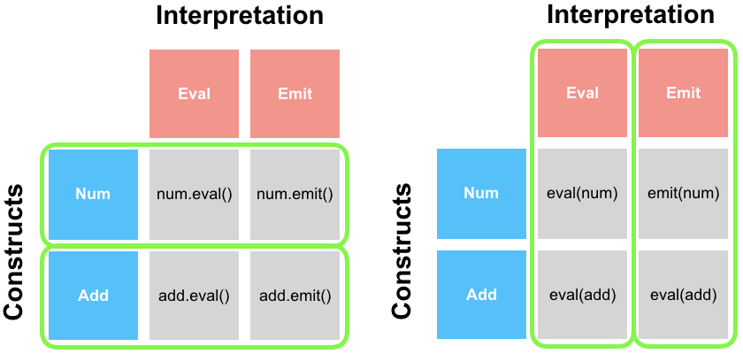

\newpage

Keywords:

: Continuous deep analytics, code generation, domain specific languages, Rust, Scala, distributed systems

# Acronyms

<!--\Begin{multicols*}{2}-->

| Acronym | Expansion                   |
|---------+-----------------------------|
| CDA     | Continuous Deep Analytics   |
| AST     | Abstract Syntax Tree        |
| IR      | Intermediate Representation |
| P-IR    | Physical IR                 |
| L-IR    | Logical IR                  |
| DSL     | Domain Specific Language    |
| GPL     | General Purpose Language    |
| JVM     | Java Virtual Machine        |
| UDF     | User Defined Function       |
| SFI     | Software Fault Isolation    |
| IFC     | Static Information Control  |

<!--\End{multicols*}-->

# Introduction

<!--What is CDA?--> Deep Analytics, or Big Data Analytics, is the application of data intensive processing techniques in the field of data mining [@DeepAnalytics]. Data can come from multiple sources in a structured, semi-structured or unstructured format. Continuous Deep Analytics (CDA) is a new form of Deep Analytics where data is also massive, unbound, and live [@ContinuousDeepAnalytics].

<!--What is this thesis about?--> This thesis is part of a five year project by KTH and RISE SICS to develop a system capable of CDA [@ContinuousDeepAnalytics]. The CDA system must be able to run for long periods of time without interruption. It also needs be capable of processing incoming queries in short time windows to support real-time decision making. CDA is aimed towards both the public sector and industry. It will enable new time-sensitive applications such as zero-time defense for cyber-attacks, fleet driving and intelligent assistants. These applications involve machine learning and graph analytics, both of which can require large scale, data intensive, matrix or tensor computations, e.g., affine transformations and convolutional operations [@DeepLearningBook]. Being able to finish these computations in real time is infeasible without hardware acceleration. The system thereby needs to be able to optimally exploit available hardware resources to speedup computation.

<!--What are the problems with Hardware Acceleration?--> Hardware acceleration is not easy. Developers must have expertise with multiple APIs and programming models which interface with the drivers, e.g., CUDA, OpenCL, OpenMP and MPI [@Virtualization]. When interfaces change, developers need to update their code. Machines in distributed systems can have various hardware configurations. For example, when scaling out, one may choose to add new machines with different hardware. This becomes an issue as code for one machine might not be portable to others.

<!--How do modern systems solve these problems? (Hardware Virtualization)--> The solution to the problem of hardware heterogeneity is hardware virtualization, which abstracts the physical hardware details away from the user [@Virtualization]. Spark and Flink realize hardware virtualization through the Java Virtual Machine (JVM) [@Spark, @Flink]. While the JVM is optimized and portable, its support for accelerator architectures, e.g., GPUs, is currently limited [@HJOpenCL]. It also has a big runtime overhead, in part owed to garbage collection. Evaluation by [@PagerankEvaluation] has revealed that a laptop running single threaded low level code can outperform a 128 core Spark cluster in PageRank. High end graph stream processing systems, GraphLab and GraphX, were outperformed as well. The evaluation measured 20 PageRank iterations for two medium sized graphs, with the largest being ~105M nodes and ~3.5B edges. An industry standard benchmark by [@Flare] revealed that Spark SQL spends close to 80% of its execution decoding in-memory data representations. Even when removing this indirection, performance remains 30% lower than hand written C code.

<!--How will CDA approach this problem?--> The CDA system will try to obtain both portability and performance simultaneously through code generation. An early overview of the system can be viewed in {@fig:CDA}. Instead of writing different code for different hardware, one will write code which is generated for different hardware. At the front-end, the user describes the desired behavior of the data processing program in a high level declarative language. The front-end code is then converted into an IR which contains information about the execution plan and cluster setup. Then, the execution plan is optimized logically through dataflow analysis, and physically by mapping tasks to machines. Next, low level code is be generated and compiled for each task, tailored to its machine's hardware. Finally, binaries are deployed in the cluster.

{#fig:CDA width=60% height=60%}

<!--How will the code generator work?--> The code generator will be written as a library in a host language. The host language receives each task as input and translates it into an Abstract Syntax Tree (AST) through the library's interface. How the AST is assembled depends on the hardware resources of the machine subject to executing the task. Code for the task is generated in a low level language by recursively visiting each node in the AST and printing its instructions.

## Background

<!--* Brief background-->
<!--* References-->

## Problem

<!--Problem definition.-->
<!--Problem statement.-->
<!--References.-->

<!--What are problems with today's code generators?--> C and C++ are a commonly used as the target language for code generation [@source]. While both compile to fast machine code, neither provide strong safety guarantees. Double free errors, null pointer dereferences and segmentation faults are recurrent errors [@RustBelt]. The CDA code generator will therefore instead emit Rust code. Rust is a recent programming language which achieves both safety and performance through a special memory policy. No Rust code generation DSL exists yet for Scala. Thereby, the problem is to implement this framework.

<!--How is the project split?--> The code generator is composed of two parts. First, it must be able to provide an interface for expressing the Rust language in Scala. The representation will be in the form of an Abstract Syntax Tree (AST). Then, it should be able to output the corresponding Rust code and compile it to an executable. This thesis focuses on the former part, while the latter is covered in a thesis by Oscar Bjuhr.

<!--What are the design goals--> The code generator is expected to be in a usable state after finishing the thesis. Thereby the following design goals, adopted from [@Polymorphic], must be satisfied.

<!--Completeness-->

<!--: The framework's Rust AST should be able to express a majority of Rust's language constructs.-->

Static semantic checking

: The framework should provide static semantic checking of AST nodes, e.g., type checking. Static syntactic checking is given by the host language, and thusly is not a concern.

Consistency

: The behavior of the generated program should be consistent with what was specified to the framework.

Runtime error reporting

: It should be possible to back-track the cause of runtime errors which occur in the produced program.

Ease of use

: The framework should be high level and declarative with minimal boilerplate code, and Rust developers should feel familiarity when using it.

Extensibility

: Considering Rust is a rapidly evolving language, the AST must be extensible in respect to both adding new constructs and interpretations.

Performance

: The framework should not take long time to execute as the driver must translate incoming IR into executables on the fly.

<!--Problem Statement--> The problem statement can be defined as: "How do you implement a framework for generating Rust code in Scala with respect to the design goals?".

## Purpose

<!--Motivation behind writing this report.--> Several modern general-purpose distributed systems, e.g., Spark and Flink, suffer from performance degradation due to placing all execution on the JVM. The purpose of this thesis is to explore code generation as a solution to these problems. Developers of future distributed systems may benefit from the discoveries. Another purpose is to motivate developers to write Rust code generators, rather than C or C++ code generators. By moving towards making Rust the mainstream target language for code generation, future distributed systems may become more safe and secure. Finally, the primary purpose is to establish a preliminary foundation for the CDA project.

## Goal

<!--Concrete deliverables.--> This thesis will explore the area of code generation. The goal is to create a code generation framework that will serve as the back-end for the CDA stream processing engine. Hence, the following deliverables are expected:

* A background study of Rust, Scala, and the theory behind code generation.
* A Scala framework for Rust code generation, and a description of its design and implementation.
* An evaluation of the framework, taking the design goals into account.

## Benefits, Ethics and Sustainability

<!--References.-->

CDA will improve upon existing state-of-the-art systems like Spark and Flink. Flink is being used by large companies such as Alibaba, Ericsson, Huawei, King, LINE, Netflix, Uber, and Zalando. Since performance is a crucial metric, these companies may benefit from incorporating CDA into their business. As an example, Alibaba uses Flink for optimizing search rankings in real-time. CDA may allow for more complex and data intensive search rank optimizations. This could in consequence be beneficial for the customer whom will have an easier time finding his or her product. While some customers will find this to be useful, others may view it as a further invasion of privacy. CDA's power comes with a responsibility, as it can be used to either help, or harm others.

In this thesis' perspective, it crucial that the code generator does not generate buggy code which could compromise security. The behavior of the generated code should be what was specified in the IR.

For sustainability, low level code is able to utilize hardware with higher efficiency than high level code. Thus, better performance in this case also implicates less waste of resources. As a result the power usage goes down, which is healthy and sustainable for the environment.

## Related Work

<!--What are the existing solutions?-->

### Spark

CDA will bear similarity, in terms of its API, with Spark. <!--What is Spark?--> Spark was designed to solve the limitations of MapReduce [@Spark: Cluster Computing with Working Sets]. While MapReduce is able to perform large-scale computations on commodity clusters, it has an acyclic dataflow model which limits its number of applications. Iterative applications such as most machine learning algorithms, and interactive analytics are not feasible on MapReduce. Spark is able to support these features, while possessing the scalability and reliability of MapReduce. The core abstraction of Spark is a Resilient Distributed Dataset (RDD). An RDD is a read-only collection of objects, partitioned over a cluster. The RDD stores its lineage, i.e., the operations which were applied to it, which lets it re-build lost partitions.

<!--What is Spark's API?--> Spark has two forms of operations: transformations and actions [@https://spark.apache.org/docs/2.2.0/rdd-programming-guide.html]. Transformations, e.g., map, and foreach, transform an RDD into a new RDD. Actions, e.g., reduce, and collect, returns the RDD's data to the driver program. All transformations are lazily evaluated. Lazy evaluation is a common optimization in distributed processing. With lazy evaluation, data in a distributed computation is materialized only when necessary. This speeds up performance by reducing the data movement overhead. [@Weld]

<!--What is Spark SQL?--> Spark SQL is an extension to Spark which brings support for relational queries [@https://people.csail.mit.edu/matei/papers/2015/sigmod_spark_sql.pdf]. It introduces a DataFrame abstraction. Unlike RDDs which are a collection of objects, DataFrames are a collection of records, i.e., a row column format. Moreover, DataFrames can be manipulated both with Spark's standard procedural API, and with a new relational API. The relational API supports SQL written queries.

### Flare

<!--What is the most relevant piece related work?--> CDA's approach to code generation draws inspiration from Flare which is a back-end to Spark [@Flare]. Flare bypasses Spark's inefficient abstraction layers by compiling queries to native code, replacing parts of the Spark runtime, and by extending the scope of optimizations and code generation to UDFs. Flare is built on top of Delite which is a compiler framework for high performance DSLs, and LMS, a generative programming technique. When applying Flare, Spark's query performance improves and becomes equivalent to HyPer, which is one of the fastest SQL engines. 

### Weld

<!--Problem with libraries--> A problem related to CDA, while not addressed in this thesis, is how to support User Defined Functions (UDFs). UDFs are functions written by the user that can make calls to external libraries. These libraries may be written in foreign languages, e.g., Python or Java, and need to somehow be translated to Rust. Libraries are naturally modular: they take input from main memory, process it, and write it back [@Weld]. As a side effect, successive calls to functions of different libraries might require materialization of intermediate results, and hinder lazy evaluation.

<!--How Weld solves it--> Weld solves these problems by providing a common interface between libraries. Libraries submit their computations in IR code to a lazily-evaluated runtime API. The runtime dynamically compiles the IR code fragments and applies various optimizations such as loop tiling, loop fusion, vectorization and common sub-expression elimination. The IR is minimalistic with only two abstractions: builders and loops. Builders are able to construct and materialize data, without knowledge of the underlying hardware. Loops consume a set of builders, apply an operation, and produce a new set of builders. By optimizing the data movement, Weld is able to speedup programs using Spark SQL, NumPy, Pandas and Tensorflow by at least 2.5x.

### ScyllaDB

NoSQL is a new series of high performance data management systems for Big Data applications [@ScyllaDB]. The consistency properties of relational SQL systems limit their scalability options. In contrast, NoSQL systems are more scalable since they store data in flexible and replicable formats such as key-value pairs. One of the leading NoSQL data stores is Cassandra, which was originally developed by Facebook. Cassandra is written in Java and provides a customizable and decentralized architecture. ScyllaDB is an open-source re-write of Cassandra into C++ code with focus on utilization of multi-core architectures, and removing the JVM overhead.

Most of Cassandra's logic stays the same in ScyllaDB. Although, one notable difference is their caching mechanisms. Caching reduces the disk seeks of read operations. This helps decrease the I/O load which can be a major bottleneck in distributed storage systems. Cassandra's cache is static while ScyllaDB's cache is dynamic. ScyllaDB will allocate all available memory to its cache and dynamically evict entries whenever other tasks require more memory. Cassandra does not have this control since memory is managed by the JVM garbage collector. In evaluation, ScyllaDB's caching strategy improved the reading performance by less cache misses, but also had a negative impact on write performance.

### Voodoo

Voodoo is a code generation framework which has been applied as the backend for MonetDB [@Voodoo]. MonetDB is a high performance query processing engine. Voodoo provides a declarative intermediate algebra which abstracts away details of the underlying hardware. It is able to express advanced programming techniques such as cache conscious processing in few lines of code. The output is optimized OpenCL code.

Code generation is complex. Different hardware architectures have different ways of achieving performance. Moreover, the performance of a program depends on the input data, e.g., for making accurate branch predictions. As a result, code generators need to encode knowledge both about hardware and data to achieve good performance. In reality, most code generators are designed to generate code solely for a specific target hardware. Voodoo solves this through providing an IR which is portable to different hardware targets. It is expressive in that it can be tuned to capture hardware-specific optimizations of the target architecture, e.g., data structure layouts and parallelism strategies. Additional defining characteristics of the Voodoo language are that it is vector oriented, declarative, minimal, deterministic and explicit. Vector oriented implicates that data is stored in the form of vectors, which conform to common parallelism patterns. By being declarative, Voodoo describes the dataflow, rather than its complex underlying logic. It is minimal in that it consists of non-redundant stateless operators. It is deterministic, i.e., it has no control-flow statements, since this is expensive when running SIMD unit parallelism. By being explicit, the behavior of a Voodoo program for a given architecture becomes transparent to the front end developer.

Voodoo is able to obtain high parallel performance on multiple platforms through a concept named controlled folding. Controlled folding folds a sequence of values into a set of partitions using an operator. The mapping between value and partition is stored in a control vector. High performance is achieved by executing sequences of operators in parallel. Voodoo provides a rich set of operators for controlled folding which are implemented in OpenCL. Different implementations for the operators can be provided depending on the backend.

When generating code, Voodoo assigns an Extent and Intent value to each code fragment. Extent is the degree of parallelism while Intent is the number of sequential iterations per parallel work-unit. These factors are derived from the control vectors and optimize the performance of the generated program.

## Delimitations

<!--What was intentionally left out?--> Only Rust will be used as the target language for code generation. It would be interesting to compare its performance to C and C++, but this is out of scope for this thesis. Moreover, the code generator will support most, but not all, of Rust's features. Instead, the focus is to develop an extensible code-generation framework. Static semantic checking for ownership will be left out since Rust's ownership policy will be changed in the near future to use non-lexical lifetimes.

## Outline

<!--What is covered in each section?.--> Section 2 goes through the relevant background of Rust, Scala, and code-generation. The CDA code-generation framework's design, and how it fits into the overall system, is covered in section 3. Section 5 contains implementation details, and section 6 evaluates the implementation with general use cases. Section 7 discusses the results with respect to the design goals. Finally, section 8 concludes with mentions about the future of CDA.

# Background

The following sections describe the Rust programming language, the Scala programming language and code generation.

## The Rust Programming Language v1.26.0

<!--What are the problems with C & Java?--> For many years, C has been used as the main goto low level system development language [@SOURCE]. While C is very optimized, it is also unsafe. Mistakes in pointer aliasing, pointer arithmetic and typecasting can be hard to detect, even for advanced software verification tools. Meanwhile, high level languages like Java solve the safety issues through a runtime which manages memory with garbage collection. This safety comes at a cost since garbage collection incurs a big overhead.

<!--What is Rust, and what makes it special?--> Rust is a modern programming language designed to overcome the tradeoff between the safety of high level languages and control of low level languages [@RustBelt]. It achieves both performance and safety through a memory management policy based on ownership. Ownership prevents data from being mutated while being aliased. In addition, Rust provides many zero-cost abstractions, e.g., pattern matching, generics, traits, and type inference.

Packages, e.g., binaries and libraries, in Rust are referred to as crates. Cargo is a crate manager for Rust which can download, compile, and publish crates. A large collection of open-source crates can be browsed on `https://www.crates.io`. Like most other software projects, Rust has a both a stable and nightly build. The nightly build is updated on a daily-basis with new experimental features that may eventually get integrated into the stable build.

Since Rust's original release, it has seen multiple major revisions. Dropped features include a typestate system <!--https://github.com/rust-lang/rust/commit/41a21f053ced3df8fe9acc66cb30fb6005339b3e-->, and a runtime system with green threaded-abstractions <!--https://github.com/rust-lang/rust/pull/18967-->. A subset of Rust's current features are listed in table {@tbl:rust}. Many of the features are present in other programming languages. The defining features of Rust are ownership and lifetimes. These are explained in the following sections. Useful features include doc comments, which lets the user write documentation directly in the code in a markdown format. Cargo can afterwards generate `.pdf` files or wikis from the doc comments.

|                             |                      |                   |
|-----------------------------+----------------------+-------------------|
| Attributes                  | (Im)mutability       | References        |
| Associated types            | **Lifetimes**        | Structs           |
| Closures                    | Macros               | Traits            |
| Control flow                | Modifiers            | Trait objects     |
| Doc comments                | Modules              | Tuples            |
| Dynamic sized types         | Namespaces           | Type aliasing     |
| Enums                       | Operator overloading | Type casting      |
| Error handling              | **Ownership**        | Type inference    |
| Foreign function interfaces | Pattern matching     | Unsafe operations |
| Functions                   | Primitives           | Variables         |
| Generics                    | Raw pointers         | Vectors           |

: A subset of Rust's features, listed in alphabetic order. Key features are marked in bold. {#tbl:rust short-caption="A subset of Rust's features"}

### Syntax

Rust's syntax consists of *expressions* and *statements*. Expressions always evaluate to a value, and can have side effects. Unlike C, Rust's control flow constructs, e.g., loops and if-else, can be *side-effect* free. For instance, loops can return a value. Statements are divided into two categories: *declaration statements* and *expression statements*. A declaration statement introduces a new name, for a variable or item, into a namespace. Variables are by default declared immutable, and are visible until end of scope. Items are components, e.g., enums, structs and functions, belonging to a crate. Expression statements are expressions which ignore the result, and as a result only have side-effects. All statements and expressions can have 

### Ownership

In Rust, when a variable is bound to an object, it takes ownership of that object. Ownership can be transferred to a new variable, which in consequence breaks the original binding. Variables can temporarily borrow ownership of an object without breaking the binding. An object can be either mutably borrowed by at most one variable, or immutably borrowed by any number of variables. Thus, objects cannot be mutably and immutably borrowed at the same time.

By restricting aliasing, Rust solves many safety issues found in other low level languages, such as double-free errors, i.e., freeing the same memory address twice. Moreover, Rust eliminates the risk of data-races as ownership applies across threads. Although Rust is not the first language to adopt ownership, previous languages featuring the concept were either too verbose or restrictive [@RustBelt].

### Lifetimes

Objects are dropped, i.e., de-allocated, when their owner variable's lifetime ends. Lifetimes in Rust are currently lexical. A variable's lifetime ends when it leaves its lexical scope. This model will be changed in the near future into non-lexical lifetimes which allow for more fine-grained control [@NLL]. Non-lexical lifetimes are resolved through liveness analysis. A variable's lifetime ends when it is no longer live, i.e., when it will no longer be used at a later time. It is possible to determine a lexical lifetime solely by analyzing the AST. Non-lexical lifetimes require more information, and are as a result calculated at a later stage, after the compiler has assembled the control-flow graph. A comparison, highlighting one advantage of non-lexical lifetimes can be viewed in Listings X and Y.

\Begin{minipage}{.475\textwidth}
```{caption="Lexical lifetimes. Both a and b's lifetimes ends when going out of scope. Since their lifetimes overlap, a.push(9) results in an error."}
fn main() {           //  'a
  let mut a = vec![]; // <-+
  a.push(1);          //   |
  a.push(2);          //   |'b
  let b = &a;         // <-+-+
  foo(a);             //   | |
  a.push(9); // ERROR //   | |
}                     // <-+-+
```
\End{minipage}\hfill
\Begin{minipage}{.475\textwidth}
```{caption="Non-lexical lifetimes. No error occurs since b's lifetime ends earlier, i.e., when it will no longer be used."}
fn main() {           //  'a
  let mut a = vec![]; // <-+
  a.push(1);          //   |
  a.push(2);          //   |'b
  let b = &a;         // <-+-+
  foo(b);             // <-+-+
  a.push(9); // OK    //   |
}                     // <-+
```
\End{minipage}

### Mutable aliasing

Ownership can in some cases be too restrictive, specifically when trying to implement graph-like data structures. For instance, implementing doubly-linked lists, where each node has a mutable alias of its successor and predecessor is difficult. There are in general two ways to achieve mutable aliasing. The first way is to use a reference counter (`Rc<T>`) together with interior mutability (`RefCell<T>`). The reference counter, i.e., smart pointer, allows an object to be immutably owned by multiple variables simultaneously. An object's reference counter is incremented whenever a new ownership binding is made, and decremented when one is released. If the counter reaches zero, the object is de-allocated. Interior mutability lets an object be mutated even when there exists immutable references to it. It works by wrapping an object inside a `RefCell`. Variables with a mutable or immutable reference to the `RefCell` can then mutably borrow the wrapped object. By combining reference counting with interior mutability, i.e., `Rc<RefCell<T>>`, multiple variables can own the `RefCell` immutably, and are able to mutably borrow the object inside.

The other way of achieving mutable aliasing is through unsafe blocks. Unsafe blocks are blocks of code wherein raw pointers can be dereferenced. Raw pointers are equivalent to C-pointers, i.e., pointers without any safety guarantees. Multiple raw pointers can point to the same memory address. The compiler cannot verify the static safety of unsafe blocks. Therefore, code inside these blocks have the potential to cause segmentation faults or other undefined behavior, and should be written with caution. While Rust is safe without using unsafe operations, many Rust libraries, including the standard library, use unsafe operations. RustBelt is an extension to Rust which verifies the soundness of unsafe blocks. It builds a semantic model of the language which is then verified against typing rules. A Rust program with well-typed unsafe blocks should not express any undefined behavior.

### Use cases

Rust might not be the ideal prototyping language, since ownership imposes another layer of semantic complexity to the programmer [@SFI_IFC]. Ownership can however solve complex security concerns such as Software Fault Isolation (SFI) and Static Information Control (IFC).

SFI enforces safe boundaries between software modules. A module should not be able to access the another module's data without permission. As an example, C can violate SFI since a pointer in one module can access another module's heap space. In contrast, Rust's ownership policy ensures that an object in memory is by default accessible through one pointer. Ownership, and information, can be transferred securely between modules without violating SFI.

IFC enforces confidentiality by tracing information routes of private confidential data. This becomes very complex in languages such as C where aliasing can explode the number of information routes. Meanwhile, IFC is easier in Rust due to its aliasing restrictions.

## Code generation

* Generate binary directly, or generate Rust and compile?

### Transpilers

### Domain Specific Languages (DSL)

<!--What are Domain Specific Languages?--> Domain Specific Languages (*DSLs*) are small languages suited to interfacing with a specific problem domain [@FoldingDSL]. DSLs often act as a complement to General Purpose Languages (*GPLs*). GPLs are in contrast to DSLs designed for a wide variety of problem domains. Since GPLs are Turing complete, anything that can be programmed in a DSL can also be programmed in a GPL. The opposite may not apply. Using DSLs can lighten the burden of solving specific problems. For example, SQL is a convenient DSL for writing search queries on relational data. By being restricted to a certain problem domain, DSLs are can offer high level abstractions without sacrificing performance. DSLs are also capable of aggressive domain-specific optimizations.

<!--External and Embedded DSLs--> DSLs can either be *external* or *embedded*. External DSLs exist in their own ecosystem, with a custom compiler, debugger, editor, etc. Building and maintaining these tools require copious amounts of work. In contrast, embedded DSLs reside within a host GPL as a library. As a result, they take less time to develop, but are restricted in their expressiveness by the host GPL's syntax.

<!--Shallow and Deep Embedding--> Embedded DSLs can either have a shallow or deep embedding [@FoldingDSL,@EDSL]. Shallow embedding implicates that the DSL is executed eagerly without constructing an intermediate representation. Hence, semantics of the host language are directly translated into terms of a target language. Deep embedding means that the DSL creates an intermediate representation, e.g., abstract syntax tree (AST). This yields more control over the program since the AST can be interpreted in multiple ways, e.g., optimized, compiled, and semantically checked. However, when continuously introducing new language features, the AST can grow large and complex. This results in a DSL which is difficult to program.

<!--Tradeoffs--> Deep embeddings are flexible in adding new interpretations, but inflexible in adding new constructs. Adding a new construct requires revising all interpretations. It is the opposite for shallow embeddings where the semantic domain is fixed. There is only one interpretation, and changing it necessitates updating all constructs.

### The Expression Problem

The tradeoff between shallow and deep embeddings is recognized as the *expression problem* [@FoldingDSL]. When implementing an embedded DSL, one can modularize by either constructs or interpretations. The expression problem is best explained with an example [@ExpressionProblem].

Consider a language with two constructs: `Add` and `Num`, and two interpretations: `Eval` and `Emit`. Both `Add` and `Num` are expressions. `Num` represents a number literal. `Add` takes two expressions and adds them together. `Eval` evaluates an AST of `Add` and `Num` constructs into a numerical value, whereas `Emit` generates a string representing the arithmetic expression.

There are two general approaches to implementing this language: an object oriented approach and a functional approach, see Fig {@fig:ExpressionProblem}. The object oriented approach is to modularize by constructs. `Add` and `Num` are classes which both implement `Eval` and `Emit` as methods. The functional approach is to modularize by interpretations. `Eval` and `Emit` are functions which both implement how to handle arguments of type `Add` and `Num`. Both approaches are imperfect. In the former, new constructs can be added by creating a new module, but adding a new interpretations requires changing all existing modules. The opposite applies for the latter.

{#fig:ExpressionProblem short-caption="Expression problem"}

[@Finally Tagless, Partially Evaluated]

Another approach is the Finally Tagless technique which builds on *typeclasses*. It uses an interface to abstract over all interpretations. The interface can be implemented to create different concrete interpretations. New constructs and interpretations can be added with ease. Constructs are added by supplementing the interface with new methods. Interpretations are added by creating new instances of the interface.

## The Scala Programming Language v2.12.4

Scala is a high level object-oriented and functional programming language. It combines the core features of Java, e.g., static typing and generic collections, with a more concise and elastic syntax. Like Java, Scala is a JVM language. For this reason, Scala and Java code integrate well with each other.

### Macros

Scala version 2.10 introduced macros. Macros enable compile-time metaprogramming. They have many uses, including boilerplate code generation, language virtualization and programming of embedded DSLs. Macros in Scala are invoked during compilation and are provided with a context of the program. The context can be accessed with an API, providing methods for parsing, type-checking and error reporting. This enables macros to generate context-dependent code. Scala provides multiple types of macros: def macros, dynamic macros, string interpolation macros, implicit macros, type macros and macro annotations.

### Parser Combinators

### Parser Generators

Regex - non-recursive

### Lightweight Modular Staging (LMS)

### Delite

# Design

Given the background, there are a set of choices to be made regarding the design of the code generator. The choices cover what type of DSL should be implemented, and how the AST should be structured.

DSL: Embedded or External

: The code generator is a sub part of the CDA project, and will need to integrate with other components in the system. An embedded DSL gives this flexibility, and is more suited towards the time frame. Therefore the embedded approach is chosen.

Embedding: Deep or Shallow

: A deep embedding yields more control by enabling variable interpretations. This control is needed for static semantic checking. Since there are more constructs than interpretations it is useful to modularize by constructs, i.e., following the object oriented approach. Users have the option to extend the AST through typeclasses.

## AST

The AST design is based on the parse tree found in Rust's *syn* library. Not all Rust features are needed, nor wanted, in the AST. For example, there is little reason to generate Rust comments. Having too many features may bloat the DSL. Features not covered by the AST are listed as bold in table {@table:???}.

Most nodes in the AST are *statements*. Statements are classified either let declarations, item declarations, or statement expressions. The remaining nodes act as children of these nodes, e.g., a match statement node has arm nodes. All top-level node types can be viewed in figure {@fig:???}.

Being able to add new AST constructs is a higher priority than being able to add new AST interpretations. Therefore the initial design of the DSL uses an object oriented approach. Typeclasses can later be used to extend the AST with new constructs or interpretations, without breaking existing code.

Deep embedded DSLs generally transform the AST with domain specific optimizations. In CDA, optimizations will happen before creating the AST, i.e., on the IR. There is no point optimizing the AST with CSE or DCE since this is handled by the `rustc` compiler.

# Implementation

The DSL is implemented in Scala with dependencies to the Shapeless library. Nodes in the AST are tuple structs. Elements of the tuple structs are treated as child nodes.

```Scala
object Eval {
  trait Eval[A] {
    def eval(x: A): String
  }
  def apply[A](implicit x: Eval[A]): Eval[A] = x
  implicit class EvalOps[A: Eval](a: A) {
    def eval = Eval[A].eval(a)
  }
}
```

```Scala
trait Exp
trait Lit extends Exp
trait BinOp extends Exp

case class Num(v: String) extends Lit
case class Add[A <: Exp, B <: Exp](l: A, r: B) extends BinOp
```

```Scala
implicit def EvalNum: Eval[Num] =
  x => s"$x"

implicit def EvalAdd[A <: Exp, B <: Exp]
  (implicit l: Eval[A], r: Eval[B]): Eval[Add[A, B]] =
  x => x.l.eval ++ "+" ++ x.r.eval
```

# Evaluation

# Discussion

# Conclusion

Expression precedence
