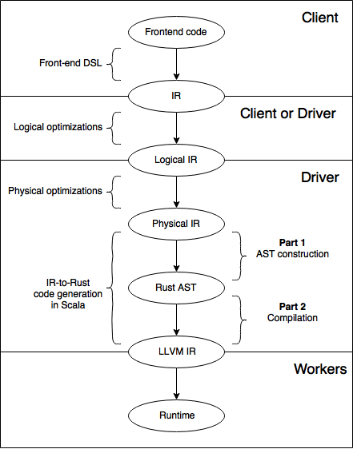

---
title: A Scala DSL for Rust code generation
titleimg: kth.png
subtitle: Master Thesis
fontsize: 12pt
author:
  - Klas Segeljakt \<klasseg@kth.se\>
affil:
  - The Royal Institute of Technology (KTH)
geometry: margin=2.54cm
toc: yes
lot: yes
lof: yes
lol: yes
date: 'July 1, 2018'
multicols: yes
graphics: yes
link-citations: true
intitute:
  - The Royal Institute of Technology (KTH)
keywords: Continuous Deep Analytics, Domain Specific Langauges, Code Generation, Rust, Scala
header-includes:
  - \usepackage{listings}
  - \usepackage{color}
  - \newcommand{\hideFromPandoc}[1]{#1}
  - \hideFromPandoc{\let\Begin\begin \let\End\end}
abstract: "<!--Introduction, Problem--> Continuous Deep Analytics is a new form of analytics with performance requirements exceeding what the current generation of distributed systems can offer. This thesis is part of a five year project in collaboration between RISE SICS and KTH to develop a next generation distributed system capable of CDA. The two issues which the system aims to solve are *hardware acceleration* and *computation sharing*. The former relates to how the back-end of current generation general purpose data processing systems such as Spark and Flink runs on the Java Virtual Machine (JVM). As the JVM abstracts over the underlying hardware, its applications become portable but also forfeit the opportunity to fully exploit the available hardware resources. Computation sharing refers to how BigData and machine learning libraries such as TensorFlow, Pandas and Numpy must collaborate in the most efficient way possible. This thesis aims to explore the area of DSLs and code generation as a solution to hardware acceleration. The idea is to translate incoming queries to the system into low-level code, tailor suited to each worker machine's specific hardware. To this end, two Scala DSLs for generating Rust code have been developed for the translation step. Rust is a new, low-level programming language with a unique take on memory management which makes it as safe as Java and fast as C. The first DSL is implemented as a string interpolator. The interpolator splices strings of Rust code together, at compile time or runtime, and passes the result to an external process for static checking. The second DSL instead provides an API for constructing an abstract syntax tree (AST), which after construction can be traversed and printed into Rust source code. The API combines three concepts: heterogeneous lists, fluent interfaces, and algebraic data types. These allow the user to express advanced Rust syntax such as polymorphic structs, functions, and traits, without sacrificing type safety."
abstrakt: N/A  
---

\clearpage

\section*{\centering{Acronyms}}

| Acronym | Definition                     |
|---------+--------------------------------|
| CDA     | Continuous Deep Analytics      |
| AST     | Abstract Syntax Tree           |
| IR      | Intermediate Representation    |
| DSL     | Domain Specific Language       |
| GPL     | General Purpose Language       |
| JVM     | Java Virtual Machine           |
| UDF     | User Defined Function          |
| FOAS    | First Order Abstract Syntax    |
| HOAS    | Higher Order Abstract Syntax   |
| SFI     | Software Fault Isolation       |
| IFC     | Static Information Control     |
| HIR     | High-level IR                  |
| MIR     | Mid-level IR                   |
| ADT     | Abstract Data Type             |
| GADT    | Generalized Abstract Data Type |

\clearpage

\section*{\centering{Acknowledgements}}

I would first like to thank my examiner, Prof. Christian Schulte, and thesis supervisors, PhD. Lars Kroll, PhD. Paris Carbone and Prof. Seif Haridi, for giving me the opportunity to be part of the CDA project. Over the course of the thesis, their expert advice and guidance has been invaluable. I would also like to thank my colleagues Johan Mickos and Oscar Bjuhr for their insightful comments and inspiring dedication to their theses. Finally, I would like to thank the Rust and Scala community on Gitter for helping me reach a deeper understanding of both languages.

\clearpage

# Introduction

<!--What is CDA?--> Deep Analytics, or Big Data Analytics, is the application of data intensive processing techniques in the field of data mining [@DeepAnalytics]. Data can come from multiple sources in a structured, semi-structured or unstructured format. Continuous Deep Analytics (CDA) is a new breed of analytics where data is also massive, unbound, and live [@ContinuousDeepAnalytics].

<!--What is this thesis about?--> This thesis is part of a five year project in collaboration between KTH and RISE SICS to develop a system capable of CDA [@ContinuousDeepAnalytics]. The CDA system must be able to run for years without interruption. It also needs to be capable of processing incoming queries in short time windows to support real-time, mission-critical, decision making. CDA is aimed towards both the public sector and industry, much like today's modern general purpose distributed systems. It will enable new time-sensitive applications such as zero-time defense for cyber-attacks, fleet driving and intelligent assistants. These applications involve machine learning and graph analytics, both of which require large scale, data intensive, matrix and tensor computations for affine transformations and convolutional operations [@DeepLearningBook]. There are two sides to the problem of supporting these kinds of heavy computations: hardware acceleration and computation sharing.

## Hardware Acceleration

<!--What are the problems with Hardware Acceleration?--> Hardware acceleration implies that the system exploits the available hardware resources to speedup computation. This is often not an easy task, since developers must have expertise with multiple APIs and programming models which interface with the drivers, e.g., CUDA, OpenCL, OpenMP and MPI [@Virtualization]. When interfaces change, developers need to update their code. As a further matter, machines in distributed systems can have various hardware configurations. The trend of scaling out, and adding new machines with different hardware, does not make things easier. Hence, hardware acceleration in the presence of hardware heterogeneity becomes an issue of maintenance when code for one machine is neither compatible nor portable to others.

<!--How do modern systems solve these problems? (Hardware Virtualization)--> The solution to the problem of hardware heterogeneity is hardware virtualization, which abstracts the physical hardware details away from the user [@Virtualization]. Spark and Flink realize hardware virtualization through the Java Virtual Machine (JVM) [@Spark][@Flink]. The JVM is portable, but its support for accelerator architectures, e.g., GPUs, is limited [@HJOpenCL]. Hence, the JVM forfeits support for hardware acceleration in favor of support for hardware heterogeneity. Moreover, it also has a runtime overhead, in part owed to garbage collection. To give an example, evaluation by [@PagerankEvaluation] has revealed that a laptop running single threaded low level code can outperform a 128 core Spark cluster in PageRank. High end graph stream processing systems, GraphLab and GraphX, were outperformed as well. The evaluation measured 20 PageRank iterations for two medium sized graphs, with the largest being ~105M nodes and ~3.5B edges. An industry standard benchmark by [@Flare] as well identified that Spark SQL spends close to 80% of its execution decoding in-memory data representations. Even when removing this layer of indirection, performance remains 30% slower than hand written C code.

<!--How will CDA approach this problem?--> The CDA system will try to obtain both portability and performance simultaneously through code generation. Instead of writing different code for different hardware, the user will write code which is generated for different hardware. Hence, the issue of maintainability is pushed to the developers of CDA rather than the users. An early overview of the system can be viewed in {@fig:CDA}. At the front-end, the user describes the desired behavior of the data processing program in a high level domain-specific language (DSL). The front-end code is then transformed into an intermediate representation (IR) containing information about the execution plan and cluster setup. Then, the execution plan is optimized logically through dataflow analysis, and physically by mapping tasks to machines. Next, low level code is generated and compiled for each task, tailored to its machine's hardware. Finally, binaries are deployed in the cluster.

{#fig:CDA width=60% height=60%}

<!--How will the code generator work?--> The code generator will also be written as a DSL. Thereby, there are two DSLs involved, the front-end, user-facing, DSL, and the back-end, developer-facing, DSL. This thesis concerns the latter, which will be written as a library in a Scala. The code generator will receive tasks as input and translate low-level source code through the library's interface. How the code is assembled depends on the hardware resources of the machines subject to executing the tasks.

## Computation Sharing

<!--Computation Sharing--> Hardware aware code generation is only half of the problem CDA will tackle. The other half is computation sharing. Queries to the CDA system may contain user defined functions (UDFs) which appear as black boxes to the pipeline. The aim is to turn the black boxes into white boxes to allow for more fine grained optimizations. The current idea is to establish common IR, similar to Weld [@Weld], across libraries and languages. This will allow cross library optimizations, and translation of UDFs written in foreign languages into Rust code.

## Background

TO BE WRITTEN

## Problem

<!--Problem definition.-->
<!--Problem statement.-->
<!--References.-->

<!--What are problems with today's code generators?--> C and C++ are a commonly used as the language for low-level systems programming [@RustBelt]. While both compile to fast machine code, neither provide strong safety guarantees. Segmentation faults and memory leaks are recurrent errors. The CDA code generator will therefore instead emit Rust code. Rust is a recent programming language which achieves both safety and performance through a special memory management policy. The problem thus to implement a DSL for Rust code generation in Scala. Rust's advanced type system makes this a difficult task.

The DSL is meant to glue pieces of code together from different libraries. Therefore, the majority of the implementation will be in pure Rust.

<!--How is the project split?--> The problem is divided into two parts code. First, the code generator must have an interface, i.e., DSL, for expressing the Rust language in Scala. Two approaches will be explored, a shallow and deep embedding. The former concatenates and statically checks snippets of Rust source code. The latter represents the program as an AST which is subsequently traversed for Rust code generation. The second part is to turn the code into an executable which can be run on multiple platforms. This thesis focuses on the former part, while the latter is covered in another thesis by Oscar Bjuhr [@Oscar].

<!--What are the design goals--> The following design goals are expected for the DSL.

* ***Coverage*** - The DSL should support as much of Rust's syntax and semantics as possible.

* ***Static checking*** - The DSLs should be able to catch errors in the user's code.

* ***Consistency*** - The behavior of the generated program should be consistent with what was specified by the user.

<!--* ***Runtime error reporting*** - It should be possible to back-track the cause of runtime errors which occur in the generated program.-->

* ***Ease-of-use*** - Writing code in the DSL should be easy, with minimum boilerplate. Developers should also feel some familiarity

* ***Extensibility*** - The DSL should be extensible to the front-end user's for adding new structs and functions, etc.

<!--* ***Performance*** - The DSL should not take long time to execute as the driver must translate incoming IR into executables on the fly.-->

<!--Problem Statement--> The problem statement can be defined as: "How do you implement a DSL for Rust code generation in Scala which satisfies the design goals?".

## Purpose

<!--Motivation behind writing this report.--> Modern general-purpose distributed systems such as Spark suffer from performance degradation due placing the workload on the JVM [@Flare]. The purpose of this thesis is to explore code generation as a solution to these problems. Developers of future distributed systems may benefit from the discoveries. Another purpose is to motivate developers to write Rust code generators, rather than C or C++ code generators. As a consequence, future distributed systems might become more secure.

## Goal

<!--Concrete deliverables.--> This thesis will explore DSLs, Rust and Scala to develop a prototype back-end code-generator for the CDA project. Hence, the following deliverables are expected: 

* A background study of programming languages, Rust, Scala, and the theory behind DSLs.
* Two Scala DSLs for Rust code generation, and a description of their design and implementation.
* An evaluation of the DSLs, taking the design goals into consideration.

## Benefits, Ethics and Sustainability

CDA will improve upon existing state-of-the-art systems like Spark and Flink. Flink is being used by large companies including Alibaba, Ericsson, Huawei, King, LINE, Netflix, Uber, and Zalando [@FlinkUsecases]. Since performance is a crucial metric, these companies may benefit from incorporating CDA into their business. As an example, Alibaba uses Flink for optimizing search rankings in real-time. CDA may allow for more complex and data intensive search rank optimizations. This should benefit the customer, whom will have an easier time finding the right product. CDA's power however comes with a responsibility, as it can be used to either help, or harm others. Although one of the use cases for CDA is cyber defence, there is nothing preventing it from being used in the opposite way. Another concern is how CDA's possible contribution to artificial intelligence might impact the lives of people. With more computation power comes more well-trained AI. This could lead to more positions of employment being succumbed by artificial intelligence, e.g., intelligent assistants and driverless vehicles.

In this thesis' perspective, it crucial that the DSL is statically safe and does not generate buggy code which could compromise security. The behavior of the generated code should be what was specified in the IR. For sustainability, low level code is able to utilize hardware with higher efficiency than high level code. Thus, better performance in this case might implicate less waste of resources. As a result the power usage goes down, which is healthy and sustainable for the environment.

## Related Work

The related work describes Spark, Flare, Weld, ScyllaDB, Apache Arrow, DataFusion <!--, SystemML-->, and Voodoo.

### Spark [@Spark]

<!--What is Spark?--> Spark is a modern general purpose distributed system for batch processing. It was designed to get around the limitations of MapReduce. While MapReduce is able to perform large-scale computations on commodity clusters, it has an acyclic dataflow model which limits its number of applications. Iterative applications such as most machine learning algorithms, and interactive analytics are not feasible on MapReduce. Spark is able to support these features, while retaining the scalability and reliability of MapReduce. The core abstraction of Spark is a Resilient Distributed Dataset (RDD). A RDD is a read-only collection of objects partitioned over a cluster. The RDD stores its lineage, i.e., the operations which were applied to it, which lets it re-build lost partitions.

<!--What is Spark's API?--> RDDs support two forms of operations: transformations and actions [@RDD]. Transformations, e.g., map, and foreach, transform an RDD into a new RDD. Actions, e.g., reduce, and collect, returns the RDD's data to the driver program. All transformations are lazily evaluated. With lazy evaluation, data in a computation is materialized only when necessary. This speeds up performance by reducing the data movement overhead [@Weld].

<!--What is Spark SQL?--> Spark SQL is an extension to Spark which brings support for relational queries [@SparkSQL]. It introduces a DataFrame abstraction. Whereas RDDs are a collection of objects, DataFrames are a collection of records. DataFrames can be manipulated both with Spark's standard procedural API and with a new relational API. The relational API supports SQL written queries.

### Flare [@Flare]

<!--What is the most relevant piece related work?--> CDA's approach to code generation draws inspiration from Flare which is a back-end to Spark. Flare bypasses Spark's inefficient abstraction layers by compiling queries to native code, replacing parts of the Spark runtime, and by extending the scope of optimizations and code generation to UDFs. Flare is built on top of Delite which is a compiler framework for high performance DSLs, and LMS, a generative programming technique. When applying Flare, Spark's query performance improves and becomes equivalent to HyPer, which is one of the fastest SQL engines. 

### Weld [@Weld]

<!--Problem with libraries--> Libraries are naturally modular: they take input from main memory, process it, and write it back. As a side effect, successive calls to functions of different libraries might require materialization of intermediate results, and hinder lazy evaluation.

<!--How Weld solves it--> Weld solves these problems by providing a common interface between libraries. Libraries submit their computations in IR code to a lazily-evaluated runtime API. The runtime dynamically compiles the IR code fragments and applies various optimizations such as loop tiling, loop fusion, vectorization and common sub-expression elimination. The IR is minimalistic with only two abstractions: builders and loops. Builders are able to construct and materialize data, without knowledge of the underlying hardware. Loops consume a set of builders, apply an operation, and produce a new set of builders. By optimizing the data movement, Weld is able to speedup programs using Spark SQL, NumPy, Pandas and Tensorflow by at least 2.5x.

### ScyllaDB [@ScyllaDB]

NoSQL is a new generation of high performance data management systems for Big Data applications. The consistency properties of relational SQL systems limit their scalability options. In contrast, NoSQL systems are more scalable since they store data in flexible and replicable formats such as key-value pairs. One of the leading NoSQL data stores is Cassandra, which was originally developed by Facebook. Cassandra is written in Java and provides a customizable and decentralized architecture. ScyllaDB is an open-source re-write of Cassandra into C++ code with focus on utilization of multi-core architectures, and removing the JVM overhead.

Most of Cassandra's logic stays the same in ScyllaDB. Although, one notable difference is their caching mechanisms. Caching reduces the disk seeks of read operations. This helps decrease the I/O load which can be a major bottleneck in distributed storage systems. Cassandra's cache is static while ScyllaDB's cache is dynamic. ScyllaDB will allocate all available memory to its cache and dynamically evict entries whenever other tasks require more memory. Cassandra does not have this control since memory is managed by the JVM garbage collector. In evaluation, ScyllaDB's caching strategy improved the reading performance by less cache misses, but also had a negative impact on write performance.

### Rain [@Rain]

Rain is an open source distributed computational framework, with a core written in Rust and an API written in Python. Rain aims to lower the entry barrier to the field of distributed computing by being portable, scalable and easy to use.Computation is defined as a task-based pipeline through dataflow programming. Tasks are coordinated by a server, and executed by workers which communicate over direct connections. Workers may also spawn subworkers as local processes. Tasks are either BIFs or UDFs. UDFs can execute Python code, and can make calls to external applications. Support for running tasks as plain C code, without having to link against Rain, is on the roadmap.

### Apache Arrow [@ApacheArrow]

Systems and libraries like Spark, Cassandra, and Pandas have their own internal memory format. When transferring data from one system to another, around 70-80% of the time is wasted on serialization and deserialization. Apache Arrow eliminates this overhead through a common in-memory data layer. Data is stored in a columnar format, for locality, which maps well to SIMD operations. Arrow is available as a cross-language framework for Java, C, C++, Python, JavaScript, and Ruby. It is currently supported by 13 large open source projects, including Spark, Cassandra, Pandas, Hadoop, and Spark.

### DataFusion [@DataFusion]

DataFusion is a distributed computational and acts as a proof-of-concept for what Spark could be if it were to be re-implemented in Rust. Spark's scalability and performance is challenged by the overhead of garbage collection and Java object serialization. While Tungsten addresses these issues by storing data off-heap, they could be avoided altogether by transitioning away from the JVM. DataFusion provides functionality which is similar to Spark's SQL's DataFrame API, and takes advantage of the Apache Arrow memory format. DataFusion outperforms Spark for small datasets, and is still several times faster than Spark when computation gets I/O bound. In addition, DataFusion uses less memory, and does not suffer from unforeseen garbage collection pauses or OutOfMemory exceptions.

<!--### SystemML [@SystemML]-->

<!--TO BE WRITTEN-->

### Voodoo [@Voodoo]

Voodoo is a code generation framework which serves as the backend for MonetDB [@Voodoo]. MonetDB is a high performance query processing engine. Voodoo provides a declarative intermediate algebra which abstracts away details of the underlying hardware. It is able to express advanced programming techniques such as cache conscious processing in few lines of code. The output is optimized OpenCL code.

Code generation is complex. Different hardware architectures have different ways of achieving performance. Moreover, the performance of a program depends on the input data, e.g., for making accurate branch predictions. As a result, code generators need to encode knowledge both about hardware and data to achieve good performance. In reality, most code generators are designed to generate code solely for a specific target hardware. Voodoo solves this through providing an IR which is portable to different hardware targets. It is expressive in that it can be tuned to capture hardware-specific optimizations of the target architecture, e.g., data structure layouts and parallelism strategies. Additional defining characteristics of the Voodoo language are that it is vector oriented, declarative, minimal, deterministic and explicit. Vector oriented implicates that data is stored in the form of vectors, which conform to common parallelism patterns. By being declarative, Voodoo describes the dataflow, rather than its complex underlying logic. It is minimal in that it consists of non-redundant stateless operators. It is deterministic, i.e., it has no control-flow statements, since this is expensive when running SIMD unit parallelism. By being explicit, the behavior of a Voodoo program for a given architecture becomes transparent to the front end developer.

Voodoo is able to obtain high parallel performance on multiple platforms through a concept named controlled folding. Controlled folding folds a sequence of values into a set of partitions using an operator. The mapping between value and partition is stored in a control vector. High performance is achieved by executing sequences of operators in parallel. Voodoo provides a rich set of operators for controlled folding which are implemented in OpenCL. Different implementations for the operators can be provided depending on the backend.

When generating code, Voodoo assigns an Extent and Intent value to each code fragment. Extent is the code's degree of parallelism while Intent is the number of sequential iterations per parallel work-unit. These factors are derived from the control vectors and optimize the performance of the generated program.

## Delimitations

<!--What was intentionally left out?--> Only Rust will be used as the target language for code generation. It would be interesting to embed other languages, e.g., C and C++, but this is out of scope for this thesis. In addition, the code generator will support many, but not all, of Rust's features. Instead, the focus is quality over quantity.

## Outline

<!--What is covered in each section?.--> Section 2 gives a bird's eye view over the area of programming languages and domain specific languages. Embedding one language in another requires in-depth knowledge about how both languages operate. Section 3 therefore covers Rust's syntax and semantics, and aims to answer the question of what is needed to embed Rust in another language. Section 4 sheds light on Scala's features and modern approaches for embedding DSLs, to identify if it can meet Rust's demands. The design of the Rust DSLs is covered in section 5. Section 6 contains implementation details, and section 7 evaluates the implementations, in the form of a demonstration. Section 8 discusses the results with respect to the design goals. Finally, section 9 concludes with mentions about future work.

\clearpage

# Programming Languages

A programming language is a tool for communicating with computers [@CraftingInterpreters]. Although programming languages can have vastly different designs, their implementations, to some degree, follow the same structure. Each program starts off as source code and is analyzed and transformed progressively in a series of stages. Compilers typically divide the stages into three components, a front-end, optimizer, and back-end [@Universal].

## Front-end

The front-end statically verifies the lexical, syntactic and semantic correctness of the program. These are analogous to verifying that sentences in natural language contain correctly spelled words, are grammatically correct, and have a sensible meaning. Simultaneously, the front-end will transform the program into an IR which is at a higher level abstraction and is easier to work with.

### Lexical analysis

First, source code is lexed, i.e., scanned, into a flat stream of tokens according to a regular expression. The source code is composed of whitespace and lexemes, i.e., lexical units, which are the words of the programming language [@LexicalStructure]. Some languages have a pre-processor which operates before the lexer. The pre-processor may alter the source code through macro expansion and various directives [@JavaCompiler]. Tokens are categories of lexemes, e.g., identifiers, keywords, literals, separators and operators. These resemble nouns, verbs, and adjectives, etc. The regular expression could be viewed as a lexicon or vocabulary which defines tokens and lexemes for a regular language. Some tokens, e.g., identifiers and literals, also have an associated semantic value.

### Syntactic analysis

After scanning, tokens are parsed into a parse tree according to a grammar. The parse tree describes the concrete syntactic structure of the program. Nodes in the tree are syntactic units, referred to as symbols. Each symbol is classified as either terminal or non-terminal. While terminals are tokens, non-terminals are symbols which may be substituted by zero or more symbols and are thereby analogous to phrases. The grammar is in the form of production rules which dictate which symbols substitute other symbols. Grammars for programming languages are in general context-free. In other words, how a symbol is parsed does not depend on its relative position to other symbols. In contrast, only a subset of the natural languages are assumed to have context-free grammars [@ContextSensitive]. History has shown however that the dissimilarity between programming languages and natural languages is decreasing as programming languages are becoming increasingly more high level [@ChalmersCompiler].

A parser can be implemented by hand with a parser combinator or be generated with a parser generator [@ChalmersCompiler, ch. 3]. Parser combinators are DSLs for constructing backtracking recursive descent parsers which operate at runtime. In contrast, parser generators generate a parser according to a context-free grammar, e.g., Backus-Naur form (BNF) grammar. Generated parsers can sometimes be more restrictive than parser combinators, but are more predictable, and offer greater performance. In addition, some parser generators can generate to multiple target languages.

After parsing, the parse tree is converted into an abstract syntax tree (AST) [@ChalmersCompiler, pp. 33]. The AST excludes needless information such as the appearance and ordering of symbols. Although each language parses to a different AST, the concept of a unified AST (UAST) across different languages and paradigms has been explored in the field of code refactoring [@UAST]. Languages would parse into separate ASTs and then combine into a UAST which enables cross-language optimizations. The idea has been put into practice in the ParaPhrase project which coalesces Erlang, C and C++ under a UAST. ParaPhrase then applies cross-language refactorings to the UAST, introducing parallel programming patterns to sequential code.

### Semantic analysis

The remaining stages of the front-end concern the program's semantics [@CraftingInterpreters]. The compiler has to determine the meaning of the program and verify if it is sensible. What constitutes as semantics varies between languages. Most languages start with *name-binding* which binds each symbol with an identifier to the site where the identifier was introduced. Another central part of semantic analysis is often *type checking*, which is about catching inconsistencies in the program. Type checking involves verifying that each operator has matching operands, to for example prevent an integer from being multiplied with a string [@DragonBook]. In some languages, it is however possible to add values of different types by coercing, i.e., implicitly converting, one type to the other. The set of rules types must conform to are defined by the *type system*. These rules are sometimes notated as *inference rules*, which draw *conclusions* from *premises*. A conclusion or premise is a *judgment* in the form of *e: T*, meaning *e* has type *T* [@ChalmersCompiler]. For example, given the premises *x: float* and *y: float*, it can be concluded that *x+y: float*. Thus, given an expression *e* and a type *T*, type checking must decide whether *e: T*. Some type systems also support type inference, which is about finding a type *T* for *e* such that *e: T*. How a type is inferred depends on how it is used. For example, if *x: float* and *x+y: int*, then *y: int* could be a possible solution. The isomorphism between type systems and logic systems is referred to as the Curry-Howard isomorphism [@CurryHoward]. Type systems derive two properties from logic systems, *soundness* and *completeness* [@SoundnessCompleteness]. A sound type system will reject programs which are not type safe. A complete type system will not reject programs which are type safe. The former prevents false negatives (misses) and the latter false positives (false alarms). Type systems of modern languages are sound but not complete [@BadSource]. If a type system is unsound for some property and moves the responsibility for checking it to the programmer, then it is weakly typed. Conversely, if a type system is statically sound, or is unsound for some property but employs dynamic checks to prevent it, then it is strongly typed. Some compilers store type information about AST symbols in a *symbol table* [@CraftingInterpreters]. The parser can also leave empty fields in the AST which get filled in later, known as *attributes*. Languages without type checking trade type errors for runtime errors and are called *untyped* languages.

## Optimizer

Optimizations commence when the program is at a sufficiently high level of abstraction [@CraftingInterpreters]. The optimizer applies various target-independent optimizations to the IR such as loop unrolling, dead-code elimination (DCE), and common sub-expression elimination (CSE). Loop unrolling unrolls a loop into a larger loop body with fewer iterations, allowing for better instruction scheduling [@DragonBook, ch. 9]. DCE removes code that computes values which never gets used. CSE locates expressions that evaluate to the same value, and substitutes them with a common variable only needing to be computed once. Certain optimizations have a space-time tradeoff. For example, loop unrolling produces faster code but also increases the executable size.

## Back-end

Finally, the back-end synthesizes machine code for a specific architecture [@CraftingInterpreters]. Multiple programming languages re-use the same back-end through a shared IR. Another option is to *transpile* the program. Instead of generating IR code targeting some back-end, transpilers generate code for some other programming language. Afterwards, a compiler for the target language may compile the generated code. Another approach is to *interpret*, i.e., directly execute, the program. Some interpreters execute by recursively traversing the AST, these are referred to as tree-walk interpreters. Certain compilers produce hardware-independent byte code instead, of hardware-dependent machine code, which gets interpreted by a *virtual machine* (VM). Some VMs support just-in-time (JIT) compilation where byte-code is compiled down to machine code just before being executed. This is combined with profiling, i.e., inspecting the code as it is being run, to allow for runtime optimizations. Ahead-of-time compilation only synthesizes code once, i.e., without runtime optimizations.

## Domain Specific Languages (DSL)

<!--What are Domain Specific Languages?--> There are two categories of programming languages: General Purpose Languages (GPLs) and Domain Specific Languages (DSLs). DSLs are small languages suited to interfacing with a specific problem domain [@FoldingDSL] and often act as a complement to GPLs. In contrast, GPLs are designed for a wide variety of problem domains. GPLs are, unlike DSLs, always Turing complete. Therefore, anything that can be programmed in a DSL can also be programmed in a GPL. The opposite may not always apply. Using DSLs can nevertheless lighten the burden of solving specific problems. For example, SQL is convenient for writing search queries on relational data. By being restricted to a certain problem domain, DSLs can offer high level abstractions without sacrificing performance. DSLs are also capable of aggressive domain-specific optimizations.

<!--External and Embedded DSLs--> A DSL can either be *external* or *embedded*. External DSLs exist in their own ecosystem, with a custom compiler, debugger, editor, etc. Building and maintaining these tools can be cumbersome. In contrast, embedded DSLs reside within a host GPL as a library or framework. As a result, they take less time to develop, but are restricted in their expressiveness by the host GPL's syntax and semantics.

<!--Shallow and Deep Embedding--> Embedded DSLs can either have a *shallow* or *deep* embedding [@FoldingDSL][@EDSL]. A shallow embedding implicates the DSL is executed eagerly without constructing an IR. A deep embedding means the DSL creates an IR which can be interpreted in multiple ways, e.g., generated, optimized, compiled, and checked. The host GPL acts as a metalanguage and the DSL as an object language. The metalanguage is able to re-shape the object language, since it is only data.

A powerful IR is higher order abstract syntax (HOAS), which is a generalization of the ordinary first-order abstract syntax (FOAS) trees, i.e., ASTs, found in compilers [@HOAS]. In FOAS, nodes refer to each other through the use of symbolic identifiers. HOAS extends FOAS by capturing name binding information. Hence, nodes in HOAS directly refer to each other with links, forming an *abstract syntax graph* instead of a tree.

Embedded DSLs come in many flavors. Popular approaches, specifically for Scala, are fluent interfaces, Quasi-Quotation, Abstract Data Types (ADTs), Generalized Abstract Data Types (GADTs), Tagless Final, Free Monads, and Lightweight Modular Staging. How these are implemented in Scala is covered in section 4.
\clearpage

# The Rust Programming Language

<!--What are the problems with C & Java?--> C and C++ have for decades been the preferred languages for low level systems programming [@SFI_IFC]. Both offer excellent performance, but are also unsafe. Mistakes in pointer aliasing, pointer arithmetic and type casting, leading to memory violations, can be hard to detect, even for advanced software verification tools. Recurrent errors are memory leaks, null pointer dereferences, segmentation faults, and data races. Although C++ facilitates countermeasures, e.g., smart pointers, RAII, and move semantics, its type system is too weak to statically enforce their usage [@RustBelt]. Meanwhile, safe high-level languages like Java solve the safety issues through managed runtime coupled with a garbage collector. This safety comes at a cost since garbage collection incurs a big overhead. Overcoming the tradeoff between safety and control has long been viewed as a holy grail in programming languages research.

<!--What is Rust, and what makes it special?--> Rust is a modern programming language conceived and sponsored by Mozilla [@RustBelt]. It overcomes the tradeoff between safety and control through a compile time memory management policy based on ownership, unique references, and lifetimes. Ownership prevents double free errors, unique references prevent data races, and lifetimes prevent dangling pointers. In addition, Rust offers zero-cost abstractions such as pattern matching, generics, traits, higher order functions, and type inference.

Packages, e.g., binaries and libraries, in Rust are referred to as crates [@RustReference, ch. 4]. Cargo is a crate manager for Rust which can download, build, and publish crates. A large collection of open-source crates can be browsed at [^1]. One of the largest crates to date is the Servo browser engine, developed by Mozilla. Servo's strict demands for security and memory safe concurrency have attributed to shaping Rust into what it is today [@RustOreilly, ch. 1].

Rust has a stable, beta, and nightly build [@Rust1, ch. 4]. The nightly build is updated on a daily-basis with new experimental features. Once every six weeks, the latest nightly build is promoted to beta. After six additional weeks of testing, beta becomes stable. Since Rust's original release, there have been multiple major revisions. Dropped features include a typestate system [@RustTypestate], and a runtime with green threaded-abstractions [@RustRuntime].

[^1]: `https://www.crates.io`.

## Basics

A Rust crate is a hierarchy of modules [@Rust1, ch. 3]. Modules contain structs, traits, methods, enums, etc., collectively referred to as items. Items support parametric polymorphism, i.e., generics. [@Lst:struct] defines a `Rectangle`{.Rust} struct and a `Triangle`{.Rust} tuple struct with fields of generic type `T`. Structs encase related values, and tuple structs are a variation of structs with unnamed fields.

```{#lst:struct .rust caption="Struct and tuple struct"}
struct Rectangle<T> {
  width:  T,
  height: T,
}
struct Triangle<T>(T, T, T);
```

Enums are tagged unions which can wrap values of different types. For example, `Shape`{.Rust} in [@lst:enum] wraps values of type `Rectangle`{.Rust} and `Circle`{.Rust}.

```{#lst:enum .rust caption="Enum."}
enum Shape<T> {
  Rectangle(Rectangle<T>),
  Triangle(Triangle<T>),
}
```

Traits define methods for an abstract type `Self`{.Rust}, and are implemented in ad-hoc fashion, comparable to type classes in other programming languages. In [@lst:trait], `Geometry`{.Rust} is a trait which defines a method for calculating the `perimeter`{.Rust}. `Rectangle`{.Rust}, `Triangle`{.Rust} and `Shape`{.Rust} implement the `Geometry`{.Rust} trait. Functions return the last expression in the function body, and as a result not require an explicit `return`{.Rust} statement.

```{#lst:trait .rust caption="Trait and implementations."}
trait Geometry<T> {
  fn perimeter(&self) -> T;
}

impl<T: Add<Output=T>+Copy> Geometry<T> for Rectangle<T> {
  fn perimeter(&self) -> T {
    self.width + self.width + self.height + self.height
  }
}

impl<T: Add<Output=T>+Copy> Geometry<T> for Triangle<T> {
  fn perimeter(&self) -> T {
    self.0 + self.1 + self.2
  }
}

impl<T: Add<Output=T>+Copy> Geometry<T> for Shape<T> {
  fn perimeter(&self) -> T {
    match self {
      &Shape::Rectangle(ref r) => r.perimeter(),
      &Shape::Triangle(ref t)  => t.perimeter(),
    }
  }
}
```

Note how the implementations require traits to be implemented for the generic types. `T: Add<Output=T>`{.Rust} requires a trait for addition to be implemented for `T`{.Rust}. `Output=T`{.Rust} implicates the result of the addition is of type `T`{.Rust} and `Copy`{.Rust} permits `T`{.Rust} to be copied. In the implementation for `Shape`{.Rust}, a `match`{.Rust} expression is used to unwrap the enum into references of its values.

[@Lst:main] defines the main function for testing the code. First, a closure, i.e., lambda function, `calc` is defined for calculating and printing the perimeter of a shape. It takes a `kind` argument, indicating whether the shape is a `Rectangle` or `Triangle`, and an array `v` storing the sides of the shape. The `!` in `println!` indicates `println` is a macro and not a method.

```{#lst:main .rust caption="Closures, struct and enum initialization, method and macro invocation, and pattern matching."}
fn main() {
  let calc = |kind: &str, v: &[i32]| {
    let shape = match kind {
      "Rectangle" => Shape::Rectangle(Rectangle{ width: v[0], height: v[1] }),
      "Triangle"  => Shape::Triangle(Triangle( v[0], v[1], v[2])),
      _           => std::process::exit(-1)
    };
    println!("Perimeter of {} is {}", kind, shape.perimeter());
  };
  calc("Rectangle", &[5,7]);  // Perimeter of Rectangle is 24
  calc("Triangle", &[3,3,3]); // Perimeter of Triangle is 9
}
```

## Syntax

Rust's syntax is mainly composed of *expressions*, and secondarily *statements* [@RustReference, ch. 6]. Expressions evaluate to a value, may contain operands, i.e., sub-expressions, and can either be mutable or immutable. Unlike C, Rust's control flow constructs are expressions, and can thereby be *side-effect* free. For instance, loops can return a value through the break statement. Expressions are either *place expressions* or *value expressions*, commonly referred to as *lvalues* and *rvalues* respectively. Place expressions represent a memory location, e.g., array an indexing, field access, or dereferencing operation, and can be assigned to if mutable. Value expressions represent pure values, e.g., literals, and can only be evaluated.

Statements are divided into *declaration statements* and *expression statements*. A declaration statement introduces a new name for a variable or item into a namespace. Variables are by default declared immutable, and are visible until end of scope. Items are components, e.g., enums, structs and functions, belonging to a crate. Expression statements are expressions which evaluate to the unit type by ignoring their operands' return results, and in consequence only produce side-effects. [@Lst:rust5] displays examples of various statements and expressions.

```{#lst:rust5 .rust caption="Rust's statements and expressions."}
struct Foo;              // Item declaration
let foo = Foo;           // Let declaration
loop { v.pop(); break; } // Expression statement
loop { break v.pop(); }  // Value expression
(1+2)                    // Value expression
*(&mut (1+2))            // Place expression
foo                      // Place expression
```

## Ownership

When a variable in Rust is bound to a resource, it takes *ownership* of that resource [@SFI_IFC]. The owner has exclusive access to the resource and is responsible for dropping, i.e., de-allocating, it. Ownership can be *moved* to a new variable, which in consequence breaks the original binding. Alternatively, the resource can be *copied* to a new variable, which results in a new ownership binding. Variables may also temporarily *borrow* a resource by taking a reference of it. The resource can either be mutably borrowed by at most one variable, or immutably borrowed by any number of variables. Thus, a resource cannot be both mutably and immutably borrowed simultaneously. The concept of ownership and move semantics relates to affine type systems wherein every variable can be used at most once [@AffineTypes].

Ownership prevents common errors found in other low level languages such as double-free errors, i.e., freeing the same memory twice. Moreover, the borrowing rules eliminate the risk of data-races. Although Rust is not the first language to adopt ownership, previous attempts were generally restrictive and demanded verbose annotations [@RustBelt]. Rust's ownership is able to solve complex security concerns such as Software Fault Isolation (SFI) and Static Information Control (IFC) [@SFI_IFC].

SFI enforces safe boundaries between software modules that may share the same memory space, without depending on hardware protection. If data is sent from a module, then only the receiver should be able to access it. This can get complicated when sending references rather than values in languages without restrictions to mutable aliasing. Rust's ownership policy ensures that the sent reference cannot be modified by the sender while it is borrowed by the receiver.

IFC imposes confidentiality by tracing information routes of confidential data. This becomes very complex in languages like C where aliasing can explode the number of information routes. IFC is easier in Rust because it is always clear which variables have read or write access to the data.

## Lifetimes

Every resource and reference has a lifetime which corresponds to the time when it can be used [@NLL][@Rust2]. The lifetime of a resource ends when its owner goes out of scope, and in consequence causes the resource to be dropped. Lifetimes for references can in contrast exceed their borrower's scope, but not their its referent's. A reference's lifetime can also be tied to others' [@AffineTypes]. For instance, a reference *A* to a reference *B* imposes the constraint that the lifetime of *A* must live for at least as long as the lifetime of *B*. Without this constraint, *A* might eventually become a dangling pointer, referencing freed memory.

Rust has a powerful type and lifetime inference which is local to function bodies. [@Lst:infertype] displays how Rust is able to infer the type of a variable based on information past its declaration site.

```{#lst:infertype .rust caption="Type inference example."}
fn foo() {
  let x = 3;
  let y: i32 = x + 5;
  let z: i64 = x + 5; // Mismatched types
}                     // Expected i64, found i32
```

Since the inference is not global, types and lifetimes must be annotated in item signatures as illustrated in [@lst:rust7][@Rust1, ch. 3]. Lifetimes in function signatures can however occasionally be concluded with a separate algorithm named *lifetime elision*. Lifetime elision adopts three rules. First, every elided lifetime gets a distinct lifetime. If a function has exactly one input lifetime, that lifetime gets assigned to all elided output lifetimes. If a function has a self-reference lifetime, that lifetime gets assigned to all elided output lifetimes. Cases when the function signature is ambiguous and the rules are insufficient to elide the lifetimes demand explicit lifetime annotations.

```{#lst:rust7 .rust caption="Type annotations, lifetime annotations, and lifetime elision."}
fn bar(x, y) -> _ { x }          // Does not compile
fn bar<T>(x: T, y: T) -> T { x } // Compiles

fn baz<T>(x: &T, y: &T) -> &T { x }             // Does not compile
fn baz<'a,T>(x: &'a T, y: &'a T) -> &'a T { x } // Compiles

fn qux<T>(x: &T) -> &T { x } // Compiles (Lifetime elision)
```

## Types

Rust has primitive, nominal, structural, pointer, function pointers, and closure types [@RustReference, ch. 7]. Primitive types include integers, floats, booleans, textual types, and the never type. Structs, unions and enums are nominal types. Nominal types can be recursive and generic. Arrays, tuples and slices are structural types, and cannot be recursive. Pointers are either shared references, mutable references, raw pointers or smart pointers. Function pointers identify a function by its input and output types. Closures have types as well, but hidden from the user.

There exists support for subtyping of lifetimes, but not structs [@RustSubtyping]. Naturally, it should be possible to use a subtype in place of its supertype. In the same sense, it should be possible to use a long lifetime in place of a shorter one. Hence, a lifetime is a subtype of another if the former lives for at least as long as the latter. Type theory formally denotes subtyping relationships by `<:`, e.g., `A <: B` indicates `A` is a subtype of `B`.

Rust's type system includes *type constructors* [@RustSubtyping]. A type constructor is a type which takes type parameters as input and returns a type as output, e.g., a generic nominal type `Option<T>`{.Rust} or pointer type `&'a mut T`{.Rust}. Types which take no type parameters are *proper types*. Type constructors can be covariant, contravariant, or invariant over their input. If `T <: U` implies `F<T> <: F<U>`, then `F` is covariant over its input. If `T <: U` implies `F<U> <: F<T>`, then `F` is contravariant over its input. `F` is invariant over its input if no subtype relation is implied. Immutable references are covariant over both lifetime and type, e.g., `&'a T`{.Rust} can be coerced into `&'b U`{.Rust} if `'a <: 'b` and `T <: U`. Contrarily, mutable references are variant over lifetime, but invariant over type. If type was covariant, then a mutable reference `&'a mut T`{.Rust} could be overwritten by another `&'b mut U`{.Rust}, where `'a <: 'b` and `T <: U`. In this case, `&'a`{.Rust} would eventually become a dangling pointer.

## Unsafe

Ownership and borrowing rules can in some cases be restrictive, specifically when trying to implement cyclic data structures [@LinkedList][@SFI_IFC]. For instance, implementing doubly-linked lists, where each node has a mutable alias of its successor and predecessor is difficult. There are in general two ways to achieve mutable aliasing. The first way is to use a reference counter (`Rc<T>`{.Rust}) together with interior mutability (`RefCell<T>`{.Rust}). The reference counter, i.e., smart pointer, allows a value to be immutably owned by multiple variables simultaneously. A value's reference counter is incremented whenever a new ownership binding is made, and decremented when one is released. If the counter reaches zero, the value is de-allocated. Interior mutability lets a value be mutated even when there exists immutable references to it. It works by wrapping a value inside a `RefCell`{.Rust}. Variables with a mutable or immutable reference to the `RefCell`{.Rust} can then mutably borrow the wrapped value. By combining reference counting with interior mutability, i.e., `Rc<RefCell<T>>`{.Rust}, multiple variables can own the `RefCell`{.Rust} immutably, and are able to mutably borrow the value inside.

The other way of achieving mutable aliasing is through unsafe blocks [@LinkedList][@SFI_IFC]. Unsafe blocks are blocks of code wherein raw pointers can be dereferenced. Raw pointers are equivalent to C-pointers, i.e., pointers without any safety guarantees. Multiple raw pointers can point to the same memory address. The compiler cannot verify the static safety of unsafe blocks. Therefore, code inside these blocks have the potential to cause segmentation faults or other undefined behavior, and should be written with caution. While Rust is safe without using unsafe operations, many Rust libraries including the standard library, use unsafe operations. Unsafe blocks are primarily used for making external calls to C. The support for calling C++ from Rust is limited however. RustBelt is an extension to Rust which verifies the soundness of unsafe blocks [@RustBelt]. It builds a semantic model of the language which is then verified against typing rules. A Rust program with well-typed unsafe blocks should not express any undefined behavior.

## Compiler overview

Rust's primary compiler is *rustc* [@rustc]. An overview of the pipeline for compiling source code into machine code is illustrated in [@fig:rustc].

{#fig:rustc width=60% height=60%}

Lexing
: Rust's lexer distinguishes itself from other lexers in how its output stream of tokens is not flat, but nested [@rustc, ch. 10]. Separators, i.e., paired parentheses `()`, braces `{}`, and brackets `[]`, form token trees. Token trees are an essential part of the macro system. As a by-product, mismatched separators are among the first errors to be caught by the front-end. The lexer will also scan for raw string literals [@RawStringLiterals]. In normal string literals, special characters need to be escaped by a backslash, e.g., `" \" "`{.Rust}. Rust string literals can instead be annotated as raw, e.g., `r#" " "#`{.Rust}, which allows ommitting the backslash. For a string literal to be raw, it must be surrounded by more hashes than what it contains, e.g., `r#"##"#`{.Rust} would need to be rewritten to `r##"##"##`{.Rust}. The implication is that Rust's lexical grammar is neither regular nor context free as scanning raw string literals requires context about the number of hashes. For this reason, the lexer is hand written as opposed to generated.

Parsing
: Rust's parser is a recursive descent parser, handwritten for flexibility [@rustc, ch. 10]. A non-canonical grammar for Rust is available in the repository [@RustGrammar]. The lexer and parser can be generated with *flex* and *bison* respectively. While bison generates parsers for C, C++ and Java, flex only targets C and C++ [@Bison][@Flex]. JFlex is however a close alternative to Flex which targets Java [@JFlex]. The parser produces an AST as output that is subject to macro expansion, name resolution, and configuration. Rust's AST is atypical as it preserves information about the ordering and appearance of nodes. This sort of information is commonly stored in the parse tree and stripped when transforming into the AST.

Macro expansion
: Rust's macros are at a higher level of abstraction compared to standard C-style macros which operate on raw bytes in the source files [@rustc, ch. 11]. Macros in Rust may contain meta-variables. Whereas ordinary variables bind to values, meta-variables bind to token-trees. Macro expansion expands macro invocations into the AST, according to their definitions, and binds their meta-variables to token-trees. This task is commissioned to a separate regex-based macro parser. The AST parser delegates any macro definition and invocation it encounters to the macro parser. Conversely, the macro-parser will consult the AST parser when it needs to bind a meta-variable.

Configuration
: Item declarations can be prepended by an attribute which specifies how the item should be treated by the compiler. A category of attributes named *conditional compilation attributes* are resolved alongside macro expansion [@rustc, ch. 7][@Rust1, ch. 4]. Other are reserved for later stages of compilation. A conditional compilation attribute can for instance specify that a function should only be compiled if the target operating system is Linux. In consequence, the AST node for the function declaration will be stripped out when compiling to other operating systems. Compilation can also be configured by supplying compiler flags, or through special comment annotations at the top of the source file, known as *header commands* [@rustc, ch. 4].

Name resolution
: Macro expansion and configuration is followed by name resolution [@rustc, ch. 12]. The AST is traversed in top-down order and every name encountered is resolved, i.e., linked to where it was first introduced. Names can be part of three different namespaces: values, types, or macros. The product of name resolution is a name-lookup index containing information about the namespaces. This index can be queried at later stages of compilation. In addition to building an index, name resolution checks for name clashes, unused imports, typo suggestions, missing trait imports, and more. 

Transformation to HIR
: Upon finishing resolution and expansion, the AST is converted into a high-level IR (HIR) [@rustc, ch. 13]. The HIR is a desugared and more abstract version of the AST, which is more suitable for subsequent analyses such as type checking. For example, the AST may contain different kinds of loops, e.g., `loop`{.Rust}, `while`{.Rust} and `for`{.Rust}. The HIR instead represents all kinds of loops as the same `loop`{.Rust} node. In addition, the HIR also comes with a HIR Map which allows fast lookup of HIR nodes.

Type inference
: Rust's type inference algorithm is local to function bodies. It is based on the Hindley-Milner (HM) inference algorithm, with extensions for subtyping, region inference, and higher-ranked types [@rustc, ch. 15]. As input, the HM algorithm takes inference variables, also called existential variables, and unification constraints [@Chalk]. The constraints are represented as Herbrand term equalities. A Herbrand term is either a variable, constant or compound term. Compound terms contain subterms, and thus form a tree-like structure. Two terms are equated by binding variables to subterms such that their trees become syntactically equivalent. [@ConstraintPhD, @ConstraintLecture] Hence, the HM algorithm attempts to find a substitution for each inference variable to a type which satisfies the constraints. Type inference fails if no solution is found. Nominal types are equated by name and type parameters, and structural types by structure. Rust's inference variables are divided into two categories: type variables and region variables. Type variables can either be general and bind to any type, or restricted and bind to either integral or floating point types. Constraints for type variables are equality constraints and are unified progressively.

Region inference
: Region variables in contrast represent lifetimes for references [@rustc, ch. 15]. Constraints for region variables are subtype constraints, i.e., outlives relations. These are collected from lifetime annotations in item signatures and usage of references in the function body. Region inference is lazy, meaning all constraints for a function body need to be known before commencing the inference. A region variable is inferred as the lower-upper bound (LUB) of its constraints. The LUB corresponds to the smallest scope which still encompasses all uses of the reference. The idea is that a borrowed resource should be returned to its owner as soon as possible after its borrowers are finished using it. Lifetimes in Rust are currently lexical. Thereby, a lifetime, or region, is always bound to some lexical scope. This model will be changed in the near future to non-lexical lifetimes (NLL) which allow for more fine-grained control [@NLL]. NLL are resolved through liveness analysis. Thus, a NLL ends when its value or reference is no longer live, i.e., when it will no longer be used at a later time. While it is possible to determine a lexical lifetime through the HIR, NLLs are derived from the MIR.

Trait resolution
: During trait resolution, references to traits are paired with their implementation [@rustc, ch. 16]. Generic functions can require parameters to implement a certain trait. The compiler must verify that callers to the function pass parameters that fulfill the obligation of implementing the trait. Trait implementations may as well require other traits to be implemented. Trait resolution fails either if an implementation is missing or if there are multiple implementations with equal precedence causing ambiguity.

Method lookup
: Method lookup involves pairing a method invocation with a method implementation [@rustc, ch. 17]. Methods can either be inherent or extensions. The former are those implemented directly for nominal types while the latter are implemented through traits, e.g., `impl Bar`{.Rust} and `impl Foo for Bar`{.Rust} respectively. When finding a matching method, the receiver object might need to be adjusted, i.e., referenced or dereferenced, or coerced to conform to the expected self-parameter.

<!--Variance inference-->
<!--: TO BE WRITTEN-->

Transformation to MIR
: After type checking finishes, the HIR is transformed into a heavily desugared Mid-Level Intermediate Representation (MIR). MIR resembles a control flow graph of basic blocks. Thus, there is no more nested structure, and all types are known to the compiler.

<!--Borrow Checking-->
<!--: TO BE WRITTEN-->

<!--## Non-lexical Lifetimes-->


<!--Ownership is enforced by the Borrow Checker. The soundness of the Borrow Checker has formally been proven to be correct in a research project named Patina [@Patina].-->


\clearpage

# The Scala Programming Language

Scala is a high level object-oriented and functional programming language. It combines the core features of Java, e.g., static typing and generic collections, with a concise and elastic syntax. Because Scala is a JVM language, Scala and Java code integrate well with each other.

## Basics

Classes, traits, and objects are the basis of Scala programs [@ScalaReference]. These are containers for members. A member is either a value, variable, method, type member, class, trait, or object. Values and variables store the result of an expression, and are immutable and mutable respectively. Methods are expressions which take parameters as input. Traits can contain abstract members and are equivalent to mixins in other languages. Classes in contrast require their members to be concrete, unless declared abstract. In addition, members can be included from multiple traits but can only be inherited from a single super class. A class or trait can also be declared as sealed, requiring all its subtypes to be declared within its file scope. Objects are singleton instances of classes.

```{#lst:scala1 .scala caption="Class, trait, and val."}
abstract class Animal {
  def sound()
}
trait Fur {
  val color: String
}
class Bear(color: String) extends Animal with Fur {
  def sound() = println("Growl")
}

val grizzly = new Bear("brown")
grizzly.sound() // Growl
```

Case classes are classes whose members are by default immutable and public [@ScalaReference]. Methods, including `toString`, `equals`, `hashCode`, `apply`, and `unapply` are automatically generated for case classes. The `equals` method compares case classes by structure, rather than reference. The `apply` method is a shorthand constructor which can be invoked without needing to specify the `new` keyword. The `unapply` method allows case classes to be deconstructed for pattern matching. To this end, case classes serve as a convenient alternative to ordinary classes.

```{#lst:scala2 .scala caption="Case class."}
case class Snake() extends Animal {
  def sound() = println("Hiss")
}

val cobra = Snake()
cobra.sound()
```

## Implicits

One of Scala's special features are *implicits* [@ScalaReference]. Implicits are either values or methods which may automatically be inserted by the compiler into parts of the program. There are two types of implicits: implicit parameters and implicit conversions.

An implicit parameter is a parameter to a method or class which does not need to be passed explicitly by the user. Instead, the compiler will search for an implicit of the specified type and insert it automatically.

```{#lst:scala4 .scala caption="Implicit parameters."}
implicit val foo: Int = 3
def bar(implicit ev: Int): Int = ev
println(bar) // 3
```

An implicit conversion is when the compiler automatically converts an object into an object of another type. In [@lst:implicitconv], method `m` is invoked on class `C`. Since `C` does not implement `m`, the compiler will search for an implicit conversion from `C` to a class implementing `m`. In this case, `conv` provides an implicit conversion from `C` to `I`. `I` implements `m`, and as a result `o` is converted to an object of class `I`.

```{#lst:implicitconv .scala caption="Implicit conversions"}
class C
class I {
  def m: String = "Hello"
}
implicit def conv(from: C): I = new I
val o: C = new C
o.m // "Hello"
// convertCtoI(o).m
```

Scala offers *implicit classes* which are syntactic sugar for injecting extension methods into classes through implicit conversions. The code in [@lst:implicitclass] injects the extension method `m` into class `C`, and is equivalent to the code in [@lst:implicitconv].

```{#lst:implicitclass .scala caption="Implicit classes"}
class C
implicit class I(o: C) {
  def m: String = "Hello"
}
val o: C = new C
o.m // "Hello"
```

### Type Classes

Scala does not support type classes as first class citizens, but can express them through implicits. [@Lst:typeclass] illustrates `String` and `Int` can be extended with type class `Print` to print values of their type. The trait `Print` is a type class, whereas `printString` and `printInt` are instances of the type class. If a trait or abstract class contains a single abstract method (SAM), instances of it can be written as lambda functions instead of typing out the whole method [@ScalaReference, ch. 6]. The `printInt` is an example of how SAM can be used.

```{#lst:typeclass .scala caption="Type class"}
// Type class
trait Print[T] {
  def print(s: T): Unit
}
// Type class instance
implicit def printString: Print[String] = new Print[String] {
  def print(s: String) = println(s)
}
// Type class instance (SAM)
implicit def printInt: Print[Int] = v => println(v.toString)

def test[T](s: T)(implicit ev: Print[T]) = ev.print(s)
test(3)     // Int: 3
test("foo") // String: foo
```

### Implicit type inference

Another use of implicit parameters is to guide the type inference. For instance, the code in listing [@lst:default] illustrates how implicits can be used to infer a default type for a type parameter `T`. If `T` is unspecified when calling `test`, it will by default be inferred to `Int`. This is accomplished through two implicits. Implicit resolution will find the most specific implicit, which is in this case `foo`. The difference between `foo` and `bar` is how `foo` requires both type parameters of `Default` to be of the same type. Hence implicit resolution for `Default[T,Int]` will resolve to `foo` if `T` is unbound, and thereby unify `T` with `Int`. In contrast, `Default[Double,Int]` will resolve to `bar` since the types don't match.

```{#lst:default .scala caption="Inferring a default type parameter, from [@Default]."}
trait Default[A,B]
object Default {
  implicit def foo[T]   = new Default[T,T] {}
  implicit def bar[T,D] = new Default[T,D] {}
}

def test[T](implicit ev0: Default[T,Int], ev1: ClassTag[T]) = println(ev1)
test         // Int
test[Double] // Double
```

Note how a `ClassTag` is needed for printing the type name. An object's class can be accessed through `myObject.getClass`{.Scala}, but this gives no information about its type parameters. The reason is the JVM erases type parameter information at runtime. Hence, a `List[Int]`{.Scala} and a `List[Double]`{.Scala} both have the same type `List`{.Scala} at runtime. To evade type erasure, one can implicitly request a `ClassTag`{.Scala} or `TypeTag`{.Scala} from the compiler. `ClassTags`{.Scala} solely contain information about a runtime class, i.e., a `ClassTag[List[Int]]`{.Scala} only gives information about `List`{.Scala}. `TypeTags`{.Scala} contain information available at compile time, i.e., `TypeTag[List[Int]]`{.Scala} includes information about both `List`{.Scala} and `Int`{.Scala}.

<!--### Macros-->

<!--Scala version 2.10 introduced macros. Macros enable compile-time metaprogramming. They have many uses, including boilerplate code generation, language virtualization and programming of embedded DSLs. Macros in Scala are invoked during compilation and are provided with a context of the program. The context can be accessed with an API, providing methods for parsing, type-checking and error reporting. This enables macros to generate context-dependent code. Scala provides multiple types of macros: def macros, dynamic macros, string interpolation macros, implicit macros, type macros and macro annotations.-->

## Shapeless

Shapeless is a generic programming library for Scala. Its core abstraction is heterogeneous lists (HLists) [@Shapeless]. An HList is a linked list where each element may have a unique type. Unlike regular Lists, HLists preserve type information of their elements, and unlike Tuples, HLists abstract over arity. [@Lst:hlist] illustrates how tuples cannot be prepended, but preserve type information of their elements. Lists can be prepended, but lose type information since all elements are coerced into the most common supertype. HLists can be prepended, while preserving type information, and as a result overcome the trade off between tuples and lists.

```{#lst:hlist .scala caption="Tuple, List and Shapeless HList."}
> val tuple = (5, "abc", 'o')
tuple: (Int, String, Char) = (5, abc, o)
> val list = List(5, "abc", 'o')
list: List[Any] = List(5, abc, o)
> val hlist = 5 :: "abc" :: 'o' :: HNil
hlist: Int :: String :: Char :: HNil = 5 :: abc :: o :: HNil

// Arity test - Prepend one element
> val tuplePrepend = 4 :: tuple
error: value :: is not a member of (Int, String, Char)
> val listPrepend = 4 :: list
lisAppend: List[Any] = List(4, 5, abc, o)
> val hlistPrepend = 4 :: hlist
hlist: Int :: Int :: String :: Char :: HNil = 4 :: 5 :: abc :: o :: HNil

// Polymorphism test - Extract head integer element
> val tupleHead: Int = tuple._1
tupleHead: Int = 4
> val listHead: Int = list(0)
error: type mismatch, found: Any, required: Int
> val hlistHead: Int = list(0)
hlistHead: Int = 4
```

The `A :: B` syntax is syntactic sugar for `::[A,B]`. An HList is thereby composed of nested type constructors. Similarly to how the last node in a linked list may point to null, the last type constructor is terminated by `HNil`, e.g., `Int::Int::HNil`. Shapeless also provides natural transformations for HLists. It is for example possible to map over the elements of an HList and apply a different function to each element depending on its type, as shown in listing [@lst:poly1].

```{#lst:poly1 .scala caption="Polymorphic function"}
> object toInt extends Poly1 {
    implicit def caseInt = at[Int](x => x)
    implicit def caseString = at[String](x => x.length)
    implicit def caseChar = at[Char](x => 1)
  }

> val hlist2 = hlist map toInt
hlist2: Int :: Int :: Int :: HNil = 5 :: 3 :: 1 :: HNil
```

Operations on HLists are implemented as type-classes. An example is the `Comapped` type class. Shapeless' documentation describes `Comapped` as a *"type class witnessing that the result of stripping type constructor `F` off each element of HList `L` is `Out"`* [@HListOps]. Listing [@lst:comappedexample] shows how `Comapped[A,Option]` witnesses that each element in `A` is wrapped inside an `Option` type constructor. `Comapped.Aux[A,Option,B]` witnesses that the result of stripping the `Option` off each element of `A` is `B`.

```{#lst:comappedexample .scala caption="Comapped example."}
type A = Option[Int] :: Option[Char] :: HNil
type B = Int :: Char :: HNil

implicitly[Comapped[A,Option]]       // OK
implicitly[Comapped.Aux[A,Option,B]] // OK
```

The main parts of the implementation for `Comapped` are displayed in listing [@lst:comapped]. The `Comapped` trait is the type class. It takes HList `L` and type constructor `F` as type parameters and produces a HList `Out` type member. The `Comapped` companion object declares an `Aux` type alias. `Aux` is a common pattern in type level programming for representing type members as type parameters [@Astronaut, ch. 3]. The convention is to unify the result of the type level computation with the last type parameter in `Aux`.

Next are the type class instances `hnilComapped` and `hlistComapped`. The former witnesses that the `Comapped` of an empty HList is `HNil`. The latter witnesses that the result of stripping `F` from the head `F[H]` of `L` and comapping the tail `T` to `TCM` is `H::TCM`. `Poly1` uses the same technique as `Comapped`, but lets the user add custom type class instances for handling elements of specific types.

```{#lst:comapped .scala caption="Comapped implementation, from [@HlistOps]."}
trait Comapped[L <: HList, F[_]] {
  type Out <: HList
}

object Comapped {

  type Aux[L <: HList, F[_], Out0 <: HList] =
    Comapped[L, F] { type Out = Out0 }

  implicit def hlistComapped[H, T <: HList, F[_], TCM <: HList](
    implicit ev: Comapped.Aux[T, F, TCM]
  ): Aux[F[H]::T, F, H::TCM] =
    new Comapped[F[H]::T, F] { type Out = H::TCM }

  implicit def hnilComapped[F[_]]: Comapped[HNil, F] =
    new Comapped[HNil, F] { type Out = HNil }
}
```

Another feature of Shapeless are records [@Shapeless]. A record is an `HList` where each value has an associated key. Keys are encoded as singleton typed literals and can be used to lookup or update values of the record. If a variable has a singleton type, then that variable can only assume one possible value. Singleton types have always been used internally by the Scala compiler, but there has not been syntax to express them externally. Shapeless exposes singleton typed literals to the programmer through implicit macros. In listing [@lst:records], `"foo" ->> 5` creates a value of type `FieldType[String("foo"), Int]`, which is an alias for `Int extends KeyTag[String("foo"), Int]` [@Labelled]. `String("foo")` is a singleton type. The call to `record("foo")` requests implicit evidence for the existence of type `FieldType[String("foo"),V]` in the record, where `V` is unbound. The evidence is as a result the associated value of type `V`.

```{#lst:records .scala caption="Shapeless records."}
> val record = ("foo" ->> 5) :: ("bar" ->> "abc") :: ("qux" ->> 'o') :: HNil

> val value = record("foo")
value: Int = 5
```

Future versions of Scala will bring first-class language support for singleton types, as depicted in listing [@lst:refined] [@SingletonType]. Another library which depends on singleton types is refined [@Refined]. Refined adds refinement types to Scala which are types that constrain their values. For instance `Int Refined Positive` constrains the `Int` to only accept positive values.

```{#lst:refined .scala caption="Refined"}
val five: 5 = 5 // Ok
val four: 4 = 5 // Error

// refined
val foo: Int Refined Positive = 3     // Ok
val bar: Int Refined Positive = -2    // Error
val qux: Int Refined Greater[20] = 22 // Ok
val baz: Int Refined Greater[20] = 10 // Error
```

## Scala DSL patterns

Scala is a language well suited for embedding domain specific languages.

<!--### Dynamically typed DSLs-->

<!--TO BE WRITTEN-->

<!--```-->
<!--object Foo extends Dynamic { ... }-->
<!--Foo.bar                // Foo.selectDynamic("bar")-->
<!--Foo.bar = "baz"        // Foo.updateDynamic("bar")("baz")-->
<!--Foo.bar("baz")         // Foo.applyDynamic("bar")("baz")-->
<!--Foo.bar(baz = "qux")   // Foo.applyDynamicNamed("bar")(("baz" -> "qux"))-->
<!--Foo.bar("baz") = "qux" // Foo.applyDynamic("bar").update("baz", "qux")-->

### Fluent Interfaces and Method Chaining

A fluent interface is a technique for initializing objects through a chain of method calls [@PracticalScalaDSLs, ch. 3]. Each call instantiates a new object which is an updated version of the old object. As an example, [@lst:fluentinterface] highlights a fluent interface '`Animal`' which is initialized and printed through a chain of method calls.

```{#lst:fluentinterface .scala caption="Fluent interface."}
case class Animal(species: String = "", color: String = "") {
  def setSpecies(newSpecies: String) = Animal(newSpecies, color)
  def setColor(newAge: Int)          = Animal(species, newColor)
  def print                          = println(color + " " + species)
}
Animal()
  .setSpecies("Fox")
  .setColor("Gray")
  .print() // Gray Fox
```

Spark's RDD API and Flink's DataStream API are instances of where this technique sees use. Through representing assignments as method calls, the object's fields can be updated without being declared as mutable. By also chaining methods one after the other, the user does not need to declare excess local variables for storing intermediate results.

### String literals

A crude approach to embedding a DSL in Scala is to envelop its code in a string literal ([@lst:literal]). Although this approach is easy to program, Scala is unable to check statically check the embedded code. An example where this pattern sees use it the Open Computing Language (OpenCL), where source code for the GPU can be written inside raw C string literals [@OpenCL]. Scala's string literals can either be written as single-line or multi-line [@ProgrammingScala]. The latter is effective for language embedding because it is a continuous block of text with fewer escape characters, since double-quotes need not be escaped.

```{#lst:literal .scala caption="String literal."}
val snippet =
  """
    object Test {
      println("Hello world")
    }
  """
```

### Language Injection

Language injection is a feature offered by the IntelliJ IDEA editor for metaprogramming [@LanguageInjection]. It can be used to imbue syntax highlighting and linting for a programming language, e.g., HTML, CSS, SQL, RegExp, into a string literal. The feature can either be enabled temporarily through IntelliJ's interface, or by placing comment annotations in the source code as in [@lst:inject]. The IntelliJ-Rust plugin for IntelliJ adds support for Rust Language Injection [@RustIntelliJ], and is capable of statically checking code up until name resolution. It will therefore detect errors such as name clashes but will miss type mismatches and ownership violations.

```{#lst:inject .scala caption="Language Injection."}
// language=Scala
val lintedSnippet =
  """
    object Test {
      println("Hello world")
    }
  """
```

### String Interpolation and Quasi Quotation

String interpolation is a feature in Scala which lets the user annotate that rules should be applied to a string literal [@ProgrammingScala, pp. 153]. In [@lst:scala18], the `s` string interpolator splices, i.e., inserts, an external value into the string literal. Scala desugars the string literal into a `StringContext`, and invokes the string interpolation method on it. External values are passed as arguments to the method call. Custom string interpolation methods can be implemented for the `StringContext` through type classes 

```{#lst:scala18 .scala caption="The 's' string interpolator"}
val x = "world"
s"Hello $x." // Desugars to: new StringContext("Hello ", ".").s(x)
```

Scala has a collection of advanced string interpolators for metaprogramming, referred to as quasi-quotes [@QuasiQuotes]. A quasi-quote takes a string literal containing a snippet of Scala code and constructs a corresponding Scala AST. Quasiquotes may be spliced with type names, term names, modifiers, flags, symbols, ASTs, and more. This facilitates the possibility of merging quasiquotes together to form a larger AST. ASTs can consequently be compiled down to byte code with runtime reflection, or deconstructed with pattern matching. Spark SQL's Catalyst optimizer relies on quasiquotes for translating incoming SQL queries into Scala byte code [@SparkSQL]. Scala's native quasi quotes are not type safe, and are limited to only supporting Scala code. Support for another language could be added by writing or generating a lexer and parser. Alternatively, Squid is an open source project for creating custom type safe Scala quasi-quote DSLs [@Squid].

```{#lst:scala19 .scala caption="Scala quasi-quotes"}
val abstractSyntaxTree =
  q"""
    object Test {
      println("Hello world")
    }
  """
```

### Algebraic Data Types

Algebraic Data Types (ADTs) are a category of recursive data types with algebraic properties [@ProgrammingScala, ch. 16]. Algebras are defined by objects, operations, and laws. Objects can for example be numbers or booleans. Operations combine objects into new ones. Laws dictate the relationships between objects and operations, e.g., associative, commutative, and distributive laws. As an example, a linked list is an ADT. Scala's `List` has two subtypes: `Nil` and `::`. The former is the empty `List`, and the latter combines an element with a `List` to form a new `List`. The number of values a `List` can attain is thus confined, and make it possible to reason clearly about the `List`'s behavior. ADTs are suited for embedding DSLs in abstract syntax. For example, [@lst:ADT] defines an algebra of integer literals and addition which is subsequently interpreted with `eval`.

```{#lst:ADT .scala caption="ADT example [@GADT]."}
sealed trait Exp
case class Lit(v: Int)         extends Exp
case class Add(l: Exp, r: Exp) extends Exp

def eval(exp: Exp): Int = exp match {
  case Lit(v)   => v
  case Add(l,r) => eval(l)+eval(r)
}

eval(Add(Lit(1), Add(Lit(9), Lit(3)))) // 13
```

### Generalized Algebraic Data Types

An issue with the ADT in [@lst:ADT] is the expectation that every expression evaluates to `Int`. This prevents the ADT from being extended with new types of algebra, e.g., `Boolean` algebra. One solution is to couple each expression with some form of evidence, i.e., type tag, indicating what it evaluates to. This kind of encoding type checks at runtime, and is known as a *tagged* encoding [@FinallyTagless]. Generalized Abstract Data Types (GADTs) generalize parameterized ADTs over the types expressions evaluate to [@PADT]. Hence, GADTs have *tagless* encoding since no type tags are involved. The DSL in [@lst:GADT] displays how [@lst:ADT] can be generalized and extended with the `Eq` operator of `Boolean` algebra.

```{#lst:GADT .scala caption="GADT DSL example [@GADT]"}
sealed trait Exp[T]
case class Lit[T](v: T)                  extends Exp[T]
case class Add(l: Exp[Int], r: Exp[Int]) extends Exp[Int]
case class Eq(l: Exp[Int], r: Exp[Int])  extends Exp[Boolean]

def eval[T](exp: Exp[T]): T = exp match {
  case Lit(v)    => v
  case Add(l, r) => eval(l) + eval(r)
  case Eq(l, r)  => eval(l) == eval(r)
}
eval(Eq(Add(Lit(1), Lit(2)), Lit(3))) // true
```

### Tagless Final

ADTs and GADTs both suffer from the expression problem [@FinallyTagless]. The expression problem is defined as:

> "The expression problem is a new name for an old problem. The goal is to define a datatype by cases, where one can add new cases to the datatype and new functions over the datatype, without recompiling existing code, and while retaining static type safety (e.g., no casts)."
>
> - Philip Wadler [@ExpressionProblemQuote]

[@Lst:ADT] and [@lst:GADT] modularize by interpretations and as a result are difficult to extend with new algebras. Tagless Final is an embedding which solves the expression problem [@FinallyTagless]. While ADTs and GADTs build a tree of values, Tagless Final instead forms a tree of function calls. The former two have an *initial* encoding, and Tagless Final, as the name denotes, has a *final* encoding. Tagless Final solves the expression problem through type classes. [@Lst:tagless] re-implements the ADT in [@lst:ADT] with a tagless final encoding. `Lit` and `Add` are type classes defining the syntax of the language. The `evalLit`, `evalAdd`, `showLit` and `showAdd` implicits are type class instances defining the DSL's semantics. The first two evaluate to an `Int`, and the second two concatenate a `String`. The `test` method implicitly imports the semantics into scope. By de-coupling constructs from interpretations, the program becomes easier to extend. Creating a new construct involves defining a new type class, along with type class instances for it covering all interpretations. Creating a new interpretation is the opposite.

```{#lst:tagless .scala caption="Tagless Final example [@TaglessFinalScala]"}
trait Lit[T] { def apply(i: Int): T     }
trait Add[T] { def apply(l: T, r: T): T }

implicit val evalAdd: Add[Int] = (l, r) => l + r
implicit val evalLit: Lit[Int] = i => i

implicit val showAdd: Add[String] = (l, r) => s"($l + $r)"
implicit val showLit: Lit[String] = i => i.toString

def test[T](implicit add: Add[T], lit: Lit[T]): T =
  add(add(lit(1), lit(9)), lit(5))

test[Int]    // 15
test[String] // ((1 + 9) + 5)
```

<!--### Free Monads-->

### Lightweight Modular Staging

Lightweight Modular Staging (LMS) is a generative programming approach which unifies the logic of the object language with the logic of the meta language.

```{#lst:lms .scala caption="Lightweight Modular Staging example [@LMS]"}
trait Base {
  type Rep[+T]
}

trait Algebra extends Base {
  implicit def lit(v: Int):          Rep[Int]
  def add(l: Rep[Int], r: Rep[Int]): Rep[Int]
}

trait Show extends Base {
  type Rep[+T] = String
}

trait ShowAlgebra extends Algebra with Show {
  implicit def lit(v: Int):          Rep[Int] = v.toString
  def add(l: Rep[Int], r: Rep[Int]): Rep[Int] = s"$l+$r"
}

trait Test { this: Algebra =>
  def test(x: Int, y: Rep[Int]): Rep[Int] = add(add(x, y), y)
}

new Test with ShowAlgebra {
  println(test(20,"(5+1)")) // "20+(5+1)"
}
```
\clearpage

# Design

Two approaches were explored for embedding Rust as a DSL in Scala.

## Shallow Embedded DSL

The first DSL is a basic string interpolator which splices snippets of Rust code together. Snippets are statically checked by passing them to the rustc compiler or the syn parser, depending on what is specified by the user. The rustc compiler can only check snippets which represent whole compilation units. In contrast, the syn parser can check individual constructs, but only syntactically. Both a runtime and compile time version of each string interpolator was implemented. The compile time version can only splice snippets in the form of literals, known at compile time.

## Deeply Embedded DSL

The second DSL is statically typed with a deep embedding. It is designed to be extensible in the direction of defining custom structs, functions, and traits. Meanwhile, the implementation of constructs and interpretations is abstracted away from the user. The DSL's API is a combination of fluent interfaces for defining items, and parameterized ADTs for constructing an AST. The Shapeless library is used to make the fluent-interfaces polymorphic and type safe. By building an AST, the DSL has a deep embedding which supports multiple interpretations. The only interpretation available at the time being is Rust code generation.

### Overview

[@Lst:design1] illustrates the directory-structure of the deeply embedded DSL. There are three modules: constructs, types, and interpretations.

```{#lst:design1 caption="Directory tree of the project."}
Rust-DSL/
+-AST.scala
+-Constructs/
| +-File.scala
| +-Expressions/
| | +-Literal.scala
| | +-Operators.scala
| | +-ControlFlow.scala
| | +-Let.scala
| +-Items/
| | +-Function.scala
| | +-Struct.scala
| | +-Trait.scala
| | +-Impl.scala
| +-Verbatim.scala
+-Types.scala
+-Interpretations/
  +-Showable.scala
```

AST defines the node and interpretation categories of the DSL. Constructs define parameterized ADT-encoded nodes for building the AST. File is the root-node of the AST. Expressions contain nodes for representing literals, control-flow expressions, operators, and let-declarations. Items provide fluent interfaces for building functions, structs, traits, and trait implementations. The main missing constructs are enums, tuples, arrays, macros, type aliases, and patterns. At the moment, these can be written in Verbatim if necessary. Types encompass Rust's primitive, reference, and nominal types. It also contains utilities for guiding Scala's type inference. Interpretations provide a `Showable`{.Scala} interpretation which nodes extend to generate code. Types in contrast use a type class for generating code. A program is synthesized by traversing its AST in top-down order. By default, types in the generated code have the same identifier as in the DSL. Identifiers for functions, variables, fields, and arguments, are specified by the user.

## Emulating `rustc`

The DSL attempts to issue a subset of `rustc`'s static checks through `scalac`. Table X lists supported and non-supported features.

| Static checks       | Supported |
|---------------------+-----------|
| Syntactic checks    | Yes       |
| Macro expansion     | No        |
| Name resolution     | Yes       |
| Type inference      | Yes       |
| Type checking       | Yes       |
| Lifetime elision    | No        |
| Region inference    | No        |
| Trait resolution    | Yes       |
| Method lookup       | Yes       |
| Coersions           | No        |
| Mutability checking | No        |
| Borrow checking     | No        |

: Static checks. [@RustOperators]. {#tbl:ops}

Parameterized ADTs ensure grammatical correctness since each node requires its children to be a specific syntactic unit. For example, a binary addition operator requires its two operands to be expressions, and will reject anything else. GADTs also establish type safety by enforcing both operands to be parameterized by the same type. If a type parameter is unspecified, Scala will attempt to infer it. Programs are written in higher-order abstract syntax for automatic name resolution. In other words, when a node refers to a variable, it will refer directly to the node of the variable rather than its identifier. Traits in Rust are programmed as type classes in Scala. Thereby, trait resolution piggybacks on implicit resolution. The main unsupported semantics are mutability checks, coercions, lifetime inference and borrow checking.
\clearpage

# Implementation

The implementation is in pure Scala with one dependency to the Shapeless library. Usage of macros is sparse.

## Shallow Embedded DSL

The shallow embedded DSL is a runtime and compile time string interpolator, as shown in [@lst:sc]. The interpolators are implemented as extension methods and extension macros for the `StringContext` class respectively. Both take a option which indicates how the spliced string should be statically checked. Four options are available: `"item"`, `"expr"`, `"type"`, and `"file"`. The first three tell the interpolator to verify that the string is a grammatically sound item, expression, or type, by piping it through Rust's `syn` parser. In contrast, `"file"` saves the snippet to a temporary file on disk and compiles it with `rustc`.

```{#lst:sc .scala caption="Rust string interpolators."}
implicit class RustInterpolator(val sc: StringContext) {
  def rrust(args: String*)(option: String): String = rustrImpl(sc, opt, args)
  def crust(args: String*)(option: String): String = macro rustcImpl
}
```

[@Lst:rrust] contains the runtime interpolator method. The call to `getSnippet` splices the string parts with the arguments into a snippet. Next, `checkSnippet` passes the snippet to `rustc` or `syn` in a separate process, depending on the option. If the process reports an error, i.e., the error code is not zero, a runtime exception is thrown with the snippet and error message, otherwise the snippet is returned.

```{#lst:rrust .scala caption="Runtime string interpolator method."}
def rustrImpl(sc: StringContext, option: String, args: Seq[String]): String = {
  val snippet = getSnippet(sc.parts, args)
  val (errorCode, errorMsg) = checkSnippet(snippet, option)
  if(errorCode != 0) {
    throw new RustException(s"$errorMsg\n>> $snippet <<\n")
  }
  snippet
}
```

[@Lst:crust] defines the compile time interpolator macro. The logic is at large the same as the runtime interpolator, with a difference being how the parameters need to be excavated from the AST. For example, `option` is extracted from `expOption.tree` through `Literal(Constant(option: String))`. As a requirement, all `expArgs` must be string literals. If `rustc` or `syn` reports an error, the macro will abort compilation with an error message.

```{#lst:crust .scala caption="Compile time string interpolator macro."}
def rustcImpl(c: Context)(expArgs: c.Expr[String]*)
                         (expOption: c.Expr[String]): c.Expr[String] = {
  import c.universe._
  val args = expArgs.map(expArg => getSplice(c)(expArg))
  val parts = getParts(c)
  val Literal(Constant(option: String)) = expOption.tree
  val snippet = getSnippet(parts, args)
  val (errorCode, errorMsg) = checkSnippet(snippet, option)
  if(errorCode != 0) {
    c.abort(c.enclosingPosition, s"$errorMsg\n>> $snippet <<\n")
  }
  c.Expr[String](Literal(Constant(snippet)))
}
```

## Deeply Embedded DSL

The construct and interpretation categories for the deeply embedded DSL are illustrated in [@lst:toplvl]. Constructs are required to implement the `show`{.Scala} method from the `Showable`{.Scala} trait. The `show` method generates code by directly printing it to a file with a designated `PrintWriter`{.Scala}. `ShowName`{.Scala} and `Show`{.Scala} are type classes for showing types. Place expressions are distinct in how they can both be evaluated and assigned to. Only a subset of items can be declared in traits. For example, a trait may contain a method but not a struct. `Items` which can appear in traits are `TraitItem`s. Expressions, let- and item declarations can all occur in statement position. 

```{#lst:toplvl .scala caption="Interpretations and constructs."}
// Interpretations
trait Showable { def show(pw: PrintWriter): Unit }
trait ShowName[T] extends Showable // Type class
trait Show[T]     extends Showable // Type class
// Constructs
trait Node        extends Showable // AST Node
trait Pat         extends Node     // Pattern
trait Stm         extends Node     // Statement
trait Exp[T]      extends Stm      // Expression
trait PlaceExp[T] extends Exp[T]   // Place Expression
trait Item        extends Stm      // Item Declaration
trait TraitItem   extends Item     // Trait Item Declaration
```

Constructs are implemented as SAM instances wherever possible. As an example, the root of the AST is a `File`{.Scala} node ([@lst:file]) taking a variable number of item declarations. Code for `File`{.Scala} is generated by invoking `show`{.Scala} on its item declarations. For convenience, an implicit class with a method `sep`{.Scala} is implemented for showing delimited sequences of `Showable` objects.

```{#lst:file .scala caption="File implementation."}
def File(items: Item*): Node = pw => items.sep("\n").show(pw)
```

### Types

The DSL represents proper types directly as Scala types, e.g., `i32`{.Scala} in [@lst:types]. Polymorphic types are depicted as Scala types with one HList type parameter, e.g., `HashMap[i32::bool::HNil]`{.Scala}. The `HList`{.Scala} contains the generics and lifetime parameters of the type. References are represented as `ref[L,T]`{.Scala} where `L`{.Scala} is a lifetime and `T`{.Scala} is a type. Tuples, arrays, and slices are not yet supported.

```{#lst:types .scala caption="Types"}
trait i32; trait bool; trait HashMap[T]; trait static; trait ref[L,T]
// Example
type A = i32                      // i32
type B = HashMap[i32::bool::HNil] // HashMap<i32,bool>
type C = ref[static,i32]          // &'static i32
```

Type and lifetime annotations are a prerequisite for item declarations. Given an AST node parameterized by a type `T`, it must be possible to show `T`. The DSL uses a type class `Show[T]`{.Scala} to show a type `T`{.Scala}. By default, implicit resolution for a type `Show[HashMap[i32::bool::HNil]]`{.Scala} will produce `"HashMap<i32,bool>"`{.Scala}. A second type class `ShowName[T]`{.Scala} exists for only showing the name of a type, e.g., `ShowName[HashMap[i32::bool::HNil]]]`{.Scala} outputs `"HashMap"`{.Scala}. In [@lst:impl4], the type class instance `showName`{.Scala} extracts a type's name from a `ClassTag`{.Scala} and prints it. The `showProper`{.Scala} and `showPoly`{.Scala} instances show proper types and polymorphic types respectively. There is no ambiguity between the two as the latter has a more specific return type.

```{#lst:impl4 .scala caption="Type class instances for showing types."}
implicit def showName[T](implicit ev: ClassTag[T]): ShowName[T] =
  pw => pw.print(ev.toString.split("(\\.|\\$)").last)

implicit def showProper[T](implicit ev: ShowName[T]): Show[T] =
  pw => ev.show(pw)

implicit def showPoly[A[_], B <: HList, C <: HList]
(implicit ev0: ShowName[A[_]],
          ev1: LiftAll.Aux[Show, B, C],
          ev2: ToTraversable.Aux[C, List, Show[_]]
): Show[A[B]] =
  pw => show"$ev0<${ev1.instances.toList[Show[_]].sep(",")}>"(pw)

// Example
implicitly[Show[HashMap[i32::bool::HNil]]].show(pw) // HashMap<i32,bool>
```

A type `Show[HashMap[i32::bool::HNil]]`{.Scala} will resolve to `showPolyType`{.Scala} which in effect requests evidence for `ShowName[HashMap[_]]`{.Scala} to extract the name `"HashMap"`{.Scala}. Afterwards, Shapeless' `LiftAll`{.Scala} retrieves the `Show`{.Scala} type class instance for each element in `i32::bool::HNil`{.Scala}. Finally, Shapeless' `ToList`{.Scala} transforms the result of `LiftAll`{.Scala} into a `List[Show[_]]`{.Scala}. A string interpolator `show`{.Scala} is implemented for showing a string, spliced with object of type `Showable`{.Scala}. For example, `show"<$x>"(pw)`{.Scala} will execute `{pw.print("<"); x.show(pw); pw.print(">")}`{.Scala}. Furthermore, an implicit conversion from `String` to `Showable` exists, allowing `Strings` to be spliced as well.

It is possible to override what a type generates to by defining a custom type class instance of `ShowName`{.Scala} for it, as displayed in [@lst:override]. For example, Rust's unit type `()` can be expressed by overriding `unit`.

```{#lst:override .scala caption="Overriding types."}
trait unit
implicit val showunit:    ShowName[unit]       = () => "()"
implicit val showHashMap: ShowName[HashMap[_]] = () => "BinaryTree"
// Example
implicitly[Show[HashMap[i32::unit::HNil]]].show(pw) // BinaryTree<i32,()>
```

### Literals

Every expression is parameterized by an invariant type parameter, indicating what the expression evaluates to. One class of expression are literals, defined in [@lst:lit]. The value a literal evaluates to is stored as a string.

```{#lst:lit .scala caption="Add"}
case class Lit[T](value: String): Exp[T] = pw => pw.print(value)
// Example
val i = Lit[i32]("1")
val b = Lit[bool]("true")
i.show(pw) // 1
b.show(pw) // true
```

### Unary Operators

Rust has the unary and binary operators highlighted in [@tbl:ops]. Scala is able to overload the unary prefix operators '`+`', '`-`', '`!`' and '`~`' [@ScalaSpec, (ch. 6.12.1)]. Other unary prefix operators can be programmed as regular methods, and as a result require parentheses at the use-site.

| Category          | Symbols                             |
|-------------------+-------------------------------------|
| Unary             | `-  !  &  *                       ` |
| Binary-Arithmetic | `+  -  *  /  %  +=  -=  *=  /=  %=` |
| Binary-Relational | `<  >  <=  >=  ==  !=             ` |
| Binary-Logical    | `&&  ||                           ` |
| Binary-Bitwise    | `^  &  |  <<  >>  ^=  &=  <<=  >>=` |
| Other             | `;  =  _  :  .  ..  ...  @  ?     ` |

: Rust's operators [@RustOperators]. {#tbl:ops}

[@Lst:unary] defines the unary prefix operators '`&`', '`*`' and '`!`', i.e., reference-of, dereference, and logic negation. The '`*`' and '`&`' operators are regular methods which correspondingly unwrap and wrap a `ref[L,T]` around a type. When dereferencing, the result is a place expression. The '`!`' operator is overloaded for boolean expressions with an extension method `unary_!`.

```{#lst:unary .scala caption="Unary operators."}
def &[T](v: Exp[T]): Exp[ref[static,T]] = pw => show"(&$v)"(pw)
def *[T](v: Exp[ref[_,T]]): PlaceExp[T] = pw => show"(*$v)"(pw)
implicit class Logical(v: Exp[bool]) {
  def unary_!: Exp[bool]                = pw => show"(!$v)"(pw)
}
// Example
val val1 = *(&(i))
val val2 = !b // Desugars to b.unary_!
val1.show(pw) // *(&(1)))
val2.show(pw) // !true
```

### Binary Operators

Binary operators are programmed as extension methods as well. [@Lst:binary] defines '`+`', '`:=`' and '`#:`', equivalent to '`+`', '`=`' and '`;`'. The '`=:`' operator assigns a value to a place expression, requiring both operands to be of the same type. The '`#:`' operator terminates a statement followed by an expression. Both '`=:`' and '`#:`' end with '`:`' and are in consequence right-associative. Right-associativity for '`#:`' implicates `{a #: b #: c;}` is evaluated as `{a;{b;{c;}}}` instead of `{{{a};b}c;}`. All assignment operators are right-associative, e.g., `x = y = z` is evaluated as `x = (y = z)`. Certain operators, such as relational operators, require parentheses, e.g., `(x == y) == z`. The remaining operators are left-associative.

```{#lst:binary .scala caption="Binary operators for addition, assignment, and statement termination."}
implicit class Add[T](val l: Exp[T]) {
  def +(r: Exp[T]): Exp[T]     = pw => show"($l + $r)"(pw)
}
implicit class Assign[T](val r: PlaceExp[T]) {
  def =:(l: Exp[T]): Exp[unit] = pw => show"$l = $r"(pw)
}
implicit class Terminate[T](val r: Exp[T]) {
  def #:(l: Stm): Exp[T]       = pw => show"$l; $r"(pw)
}
// Example
val exps = (val1 =: (i+i)) #: b
exps.show(pw) // (*(&1)) = (1+1); true
```

### If-Else

[@Lst:cflow] defines the `If` expression which requires a condition and if-clause. `If` can be chained with `Else` into an if-else, given that the if- and else-clause evaluate to values of the same type. Because `If` has more than one method, it cannot be written as a SAM instance.

```{#lst:cflow .Scala caption="If-Else definition."}
def If[T](cond: Exp[bool])(ic: Exp[T]) = new Exp[T] {
  def Else(ec: Exp[T]): Exp[T] = pw => show"if $cond { $ic } else { $ec }"(pw)
  def show(pw: PrintWriter) =          show"if $cond { $ic }"(pw)
}
// Example
val if_else = If(b) { i+i } Else { i }
if_else.show(pw) // if true { 1+1 } else { 1 }
```

### Let

A variable is treated by the DSL as a function with one argument. For example, `{let x: i32 = 3; x+x}` is isomorphic to `(|x: i32| x+x )(3)`. The `Let` node in [@lst:var], for generating a `let` declaration, takes a `value`, an `id`, and a function `fn`. The `id` is by default generated with `new_id` which is a global counter, but can also be specified manually. The `value` is bound to a `variable` with name `id`. `Let` evaluates to the `result` of applying `fn` to the `variable`.

```{#lst:var .Scala caption="Let definition."}
def Let[T,O](value: Exp[T], id: String = new_id)
            (fn: PlaceExp[T] => Exp[O]): Exp[O] =
 pw => {
    val variable: PlaceExp[T] = pw => pw.print(id)
    val result = fn(variable)
    show"{let $variable = $rhs; $result}"(pw)
 }
// Example
val let1 = Let(i) { x => x+x }
let1.show(pw) // {let x1 = 1; (x1 + x1)}
val let2 = Let(i, "x") { x => x+x }
let2.show(pw) // {let x = 1; (x + x)}
```

### Functions

Functions, and other items, are implemented with fluent interfaces. The idea is to construct the function incrementally through method chaining, adding arguments, bounds, attributes, etc. When finished, the function can either be declared, called or inlined. The parameters of the fluent interface are declared in [@lst:fnheader]. A function must have a name, but the rest, i.e., attributes, bounds, arguments, and body, is optional. Arguments are stored in both a Shapeless `HList`{.Scala} and a regular `List`{.Scala}. The purpose of the `HList`{.Scala} is to abstract over the arity of the input argument list, and ensure type safety inside the function body. The `List`{.Scala} is solely used for showing the arguments. The `FnArg` type can either be instantiated as an ordinary argument or a self-argument. By default, the return type of a function is the unit type `()`{.Rust} unless specified otherwise, e.g., `fn main() { ... }`{.Rust} desugars to `fn main() -> () { ... }`{.Rust}. Hence, `O`{.Scala}, which is the return type, is by default inferred to `unit`{.Scala}, using the `Default`{.Scala} type class described in the background.

```{#lst:fnheader .Scala caption="Fluent interface parameters (Function)"}
case class Fn[I <: HList, O:Df[unit]#L](
  NAME:    String              = "",
  ATTRS:   String              = "",
  BOUNDS:  String              = "",
  ARGS:    I                   = HNil,
  ARGLIST: List[FnArg[_]]      = List(),
  BODY:    Option[I => Exp[O]] = None
) extends Exp[O] {
```

[@Lst:arg] describes the implementation for ordinary arguments. An argument may either appear declared in a function signature, inserted at a call-site, used in a function body, or inlined as a local variable. Arguments must therefore be able to show their identifier, expression, and type. The identifier is given using Shapeless' `Witness.Aux[K]` which extracts the value from a singleton type literal.

```{#lst:arg .Scala caption="Argument definition."}
def newArg[K,V](exp: Exp[V])
               (implicit ev1: Witness.Aux[K], ev2: Show[V]) = new FnArg[V] {
  val id = ev1.value.toString
  def decl:   Stm = pw =>     show"$id: $ev2"(pw)
  def inline: Stm = pw =>     show"let $id = $exp"(pw)
  def insert: Stm = pw =>     show"$exp"(pw)
  def show(pw: PrintWriter) = show"$id"(pw)
}
```

Each parameter in the interface comes with setter method. For instance, `arg` in [@lst:fnstage] is a method part of the fluent interface for adding an argument to the function. As input, `arg` expects an record field where the value is an expression, e.g., `("id" ->> exp)`. A corresponding field is then created and added to the fluent interface. `K` and `V` require view bounds for propagating the implicits the `newArg` method expects.

```{#lst:fnstage .Scala caption="Staging a function."}
def arg[K:Witness.Aux, V:Show](exp: FieldType[K, Exp[V]]) = {
  val arg = field[K](newArg[K,V](exp))
  Fn(NAME, ATTRS, BOUNDS, arg::ARGS, arg::ARGLIST, None)
}
```

[@Lst:fnunstage] displays how the fluent interface declares a method. Since Rust demands explicit type annotations in the function signature, implicit evidence is needed for declaring the output type. Conditionally, the function body is only declared if it has been specified.

```{#lst:fnunstage .Scala caption="Unstaging a function."}
def decl(implicit ev: Show[O]): TraitItem = pw => {
  val input = ARGLIST.reverse.map(_.decl).sep(", ")
  if (BODY.isEmpty) {
    show"fn $NAME$BOUNDS($input) -> $ev;"(pw)
  } else {
    val output = BODY.get.apply(ARGS)
    show"fn $NAME$BOUNDS($input) -> $ev {$output}"(pw)
  }
}
```

The fluent interface can then be used as in listing [@lst:fntest] for writing a function which calculates the maximum value of two integers. `PH`, or PlaceHolder, is an object which can which can be implicitly converted into any other expression. In other words, `PH` can always be passed in place of an expression, and can be used as a placeholder for expressions when creating item declarations.

```{#lst:fntest .Scala caption="Function example"}
def max(x: Exp[i32], y: Exp[i32]) =
  Fn()
    .name("max")
    .arg("x" ->> x)
    .arg("y" ->> y)
    .returns[i32]
    .body { args =>
      If(args("x") > args("y")) { args("x") } Else { args("y") }
    }

max(i, i+i).show(pw)        // max(1, 1+1)
max(i, i+i).inline.show(pw) // if (1 > 1+1) { 1 } else { 1+1 } 
max(PH, PH).decl.show(pw)
// fn max(x: i32, y: i32) -> i32 {if (x > y) { x } else { y }}

```

## Structs

The fluent interface for structs employ the same strategy as functions. A struct has a type, and optionally fields, bounds, and attributes. These are defined in [@lst:struct]. `S` is the type of the struct, and `F` is the types of the fields. The struct's type is thereby separated from its fields, as is specified for nominal types.

```{#lst:struct .Scala caption="Fluent interface parameters (Struct)"}
case class Struct[S, F <: HList](
  NAME:      Showable          = "",
  BOUNDS:    String            = "",
  ATTRS:     String            = "",
  FIELDLIST: List[StructField] = List()
) extends Exp[S] { ... }
```

[@Lst:accessfield] implements the '`f`' operator, equivalent to '`.`', for accessing fields. When invoking '`f`' on an expression `Exp[S]`, the compiler will attempt to find implicit evidence for `Struct[S,F]`, which if found unifies `F`. As input, the '`f`' operator takes a key and uses Shapeless' `Selector.Aux[F,key.T,V]` to unify the type `V` of its associated value. The product is a place expression of type `V`, representing the accessed field.

```{#lst:accessfield .scala caption="Access field"}
implicit class FieldAccess[S,F<:HList](exp: Exp[S])
                                      (implicit ev: Struct[S,F]) {
  def f[V](key: Witness)
          (implicit ev: Selector.Aux[F,key.T,V]): PlaceExp[V] =
    pw => show"$exp.${key.value.toString}"(pw)
}
```

As an example, listing [@lst:structtest] displays how to declare a `Point` struct with two integer fields. The implicit value is required as evidence for looking up the fields.

```{#lst:structtest .scala caption="Struct example"}
trait Point
val point(x: Exp[i32], y: Exp[i32]) =
  Struct()
    .name[Point]
    .field("x" ->> x)
    .field("y" ->> y)
implicit val pointDefinition = point(PH,PH)

point(PH, PH).decl.show(pw) // struct Point { x: i32, y: i32 }
Let(point(i, i)) { s =>
  s.f("y")
}.show(pw) // let x1 = Point { x: 1, y: 1 }; x1.y
```

<!--## Traits and Impl-->

<!--Traits and implementations are equivalent to type classes and type class instances. Given a trait `T` and a type `S`, it should be possible to query for an implementation of `T` for `S`. Traits contain trait items which are either constant values, methods, type aliases, or macros [@SynTraitItem]. At the moment, only methods are supported. [@Lst:math] illustrates how to declare a Rust trait, the user first declares a regular type class `Math[Self]` containing instances of `Fn`. Then, an instance of the type class is passed to a fluent interface, which declares all the members.-->

<!--```{#lst:trait .scala caption="Trait example"}-->
<!--// Trait-->
<!--trait Math[S] {-->
  <!--def square(a: Exp[S]) =-->
    <!--Fn()-->
      <!--.arg("a" ->> a)-->
      <!--.returns[i32]-->
      <!--.body { args =>-->
        <!--args("a") * args("a")-->
      <!--}-->
<!--}-->
<!--val math =-->
  <!--Trait().-->
    <!--.inst(new Math[Self])-->
    <!--.member(_.square.decl)-->
<!--```-->

<!--The trait is subsequently implemented by instantiating the type class as shown in [@lst:impl]. -->

<!--```{#lst:impl .scala caption="Impl example"}-->
<!--// Implementation-->
<!--implicit def Mathi32 = new Math[i32] {}-->
<!--val mathi32 =-->
  <!--Impl().-->
    <!--.inst(i32Math)-->
    <!--.self[i32]-->
    <!--.member(_.square.decl)-->

<!--math.decl.show(pw)-->
<!--mathi32.decl.show(pw)-->
<!--```-->
\clearpage

# Evaluation

The evaluation is in the form of a demonstration, testing the features and static checking capabilities of the two DSLs.

## Shallow Embedded DSL - Validation testing

The runtime and compile time interpolators are evaluated with validation testing. Code for the tests is displayed in listing [@lst:tests]. Each test applies an interpolator `X` to a string, which splices it with arguments and then checks it with option `Y`. `X` and `Y` are the control variables. `X` is either substituted with `rrust` or `crust`. `Y` is replaced by either `"file"` or `"item"`. Hence, each test is run with four variations. The tests can be described as:

* **Test 1**: Interpolate a string by splicing it with a string literal, into a statically correct string, and then check it. The result is asserted.
* **Test 2**: Interpolate a string by splicing it with a string literal, into a syntactically incorrect string, and then check it.
* **Test 3**: Interpolate a string by splicing it with a string literal, into an statically incorrect, but syntactically correct string, and then check it.
* **Test 4**: Interpolate a string by splicing it with the result of a compile time interpolator, into a statically correct string, and then check it.

```{#lst:tests .Scala caption="Shallow DSL validation tests"}
// Test 1
val a = "i32"
assert(X"fn main() { let x: $a = 3; }"(Y) == "fn main() { let x: i32 = 3; }")

// Test 2
val b = ";"
X"fn main() { let x: $b = 3; }"(Y)

// Test 3
val c = "f32"
X"fn main() { let x: $c = 3; }"(Y)

// Test 4
val d = crust"(1+2)"("expr")
X"fn main() { let x = $d; }"(Y)
```

The results of the tests are listed in [@tbl:results]. True positive (`TP`) means the interpolator reported an error when it should have. False positive (`FP`) means the interpolator reported an error when it should not have. True negative (`TN`) means the interpolator did not report an error when it should not have. False negative (`FN`) means the interpolator did not report an error when it should have. In short, `TP` and `TN` denotes expected behavior, and **`FN`** and **`FP`** denotes unexpected behavior. The error messages for some of the tests are included in appendix A.

| Test | rrust+rustc | rrust+syn | crust+rustc | rrust+syn |
|------+-------------+-----------+-------------+-----------|
| 1    | TN          | TN        | TN          | TN        |
| 2    | TP          | TP        | TP          | TP        |
| 3    | TP          | **FN**    | TP          | **FN**    |
| 4    | TN          | TN        | **FP**      | **FP**    |

: Results from the interpolator test. {#tbl:results}

## Deeply Embedded DSL - Demo

The deeply embedded DSL is evaluated by writing a program which combines the features described in the implementation. First, types and literals are declared in listing [@lst:demo1]

```{#lst:demo1 .scala caption="Types and literals."}
trait A
trait Rectangle[T] extends Polymorphic { type G = T::HNil }
val f = Lit[i32]("7")
val i = Lit[i32]("5")
```

Then, [@lst:demo2] declares a struct `Rectangle` with a generic width and height along with an implicit lookup function. The attributes and bounds are specified as strings.

```{#lst:demo2 .scala caption="Rectangle"}
def Rectangle[T:Show](x: Exp[T], y: Exp[T]) =
  Struct()
    .name[Rectangle[T]]
    .attrs("#[derive(Copy)]")
    .bounds("<A>")
    .field("x" ->> x)
    .field("y" ->> y)
implicit def RectangleDefinition[T:Show] = Rectangle[T](PH, PH)
```

[@Lst:demo3] defines a `perimeter` function for calculating the perimeter of a `Rectangle`.

```{#lst:demo3 .scala caption="perimeter"}
def perimeter[T:Show](r: Exp[Rectangle[T]]) =
  Fn()
    .name("perimeter")
    .bounds("<A:Add<Output=A>>")
    .arg("r" ->> r)
    .returns[T]
    .body { args =>
      args("r").f("w") + args("r").f("w") +
      args("r").f("h") + args("r").f("h")
    }
```

[@Lst:demo4] implements the `main` function which creates a `Rectangle` and calculates its `perimeter`.

```{#lst:demo4 .scala caption="main"}
def main =
  Fn()
    .name("main")
    .body { args =>
      Let(Rectangle(i, i)) { r =>
        perimeter(r) :#
      }
    }
```

Finally, [@lst:demo5] inserts the items into a `File` and generates code to a file `demo.rs`.

```{#lst:demo5 .scala caption="driver"}
def driver() = {
  val pw = new PrintWriter(new java.io.File("demo.rs"))

  File(
    Use("std::ops::Add;")
    Rectangle[A](PH, PH).decl,
    perimeter[A](PH, PH).decl,
    main.decl
  ).show(pw)

  pw.close()
}
```

Generated code [^2]:

[^2]: Appendix B includes the generated code after formatting it with `rustfmt`.

```
$ cat demo.rs
use std::ops::Add;
fn perimeter<A:Add<Output=A>>(x: Rectangle<A>, y: A) -> A {(x.a + y)}
struct Qux<A> {a: A, b: i32}
fn main() -> () {{let a = Qux { a: 1,b: 2 }; {let b = 5; foo(a,b); ()}}}
```

Compiling with `rustc`:

```
$ rustc output.rs
warning: field is never used: `b`
 --> output.rs:7:5
  |
7 |     b: i32,
  |     ^^^^^^
  |
  = note: #[warn(dead_code)] on by default
```


\clearpage

# Discussion

The evaluation for the shallow DSL is as expected. The runtime interpolator, with calls to *rustc*, passes all the tests, but is also the most limited as it only accepts whole files as input. When instead using *syn*, the interpolators fail to detect type errors. Moreover, the *syn* parser gives little advantage over using IntelliJ's language injection, since language injection will in addition to parsing also do linting and name binding. A different approach would be to generate a Rust parser which parses a Rust AST, and analyze it semantically through macros. At present time, the official grammar at the Rust repository is not canonical and might therefore not work as expected.

The compile time interpolators return an AST string literal, but it appears the AST is not propagated to other macro calls. The solution libraries such as Quill employ, for communicating between macros, is to encode AST information inside of types [@Quill]. The idea is to move information from the AST into the symbol table, which is accessible by all macros. In Quill, everything is a whitebox macro which produces an AST with an associated type annotation. The type annotation encodes information about the AST. Other macros can then access the AST by decoding the type annotation.

The deeply embedded DSL is currently limited in the number of constructs it can express, but should have more potential than the shallow DSL. One potential is to turn the AST into an UAST by adding interpretations to other languages, e.g., C or C++. The DSL might even be able to introduce new semantics to the languages. For instance, C's lack of generics could be compensated for by generating monomorphic code. A generic struct in Rust such as `struct Point<T> { x: T, y: T }` could be expressed in C by generating duplicates, e.g., `Point_int { int x; int y; }` and `Point_float { float x; float y; }`, covering the needs for all use-sites. Unifying Rust with C++ is more difficult since their concepts do not map well to each other.

Support for coercions is one of the main missing semantic features. Implicit conversions could be one way of implementing coercions. A different approach is to turn expressions covariant, i.e., `Exp[+T]` instead of `Exp[T]`. Scala's lower-upper-bounding inference can make covariance problematic. If `Exp` is covariant, then the result of adding two expressions of unrelated types, e.g., `Exp[i32]` and `Exp[f32]`, will produce `Exp[Any]`. By default, Scala will not complain over inferring `Any`, but this could be solved by adding the flags: `-Ywarn-infer-any` and `-Xfatal-warnings`. 

Another missing feature are patterns, which is a pre-requisite for constructs such as `Enum`s and `match`. While implicits could be used to verify if a pattern matches an expression, the difficult part is extracting the matching variables from the pattern. An idea is to express all patterns using Rust's '`@`' operator. The '`@`' operator binds the match of a pattern to a single variable. For example, given a `struct Foo { x: i32, y: i32 }`, the pattern `Foo { x, y } => x+y` would be expressed as `foo @ Foo { _, _ } => foo.x+foo.y`. This should be easier to work with since only one variable needs to be taken into consideration.

Structural types, i.e., tuples, arrays, and slices, require backing as well. Tuples could be expressed as regular `HList`s. Arrays are more difficult since their size is part of the type, e.g., the type of an array with five integers is `[i32, 5]`. Creating a unique type for each size, such as `_1`, `_2`, ..., is one solution. Another is to express the size as a singleton type literal. When Scala's establishes first-class language support for these, it should be possible to express arrays as `array[i32,5]`.

Nothing currently prevents an immutable place expression from being mutated. Mutability is not tracked, but could be by embedding additional type information into expressions. A mutable expression could be expressed as `Mutable extends Exp[T]`, and an immutable as `Exp[T]`. Thereby, any mutable expression can be converted to immutable, but not the other way around.

## Design goals

The shallow embedded DSL covers all of Rust's syntax and semantics. In addition, the DSL can be extended with new items which may also be monkey-patched at runtime. A downside is how static checking is restricted to string literals which are whole compilation units. However, the benefit of string literals is the consistency between the written and generated code, since everything is generated exactly as written. Combined with linting from language injection, it should also be easy for the user to detect syntax errors and name clashes.

The deeply embedded DSL is held back by the host language, and as a result cannot cover all of Rust's semantics. Macros could although possibly be used to change Scala's semantics into something which accommodates for Rust's. Despite semantics are only verified up until type checking, this might be enough for most tasks. In terms of ease-of-use, the combination of ADTs and fluent interfaces makes the code relatively easy to read and write, but it is not always obvious what will be generated.

\clearpage

# Conclusion

Code generation DSLs will be a crucial component in the next generation of distributed systems for exploiting the resources of heterogeneous hardware. Rust's safety guarantees, combined with its zero cost abstractions, makes it a promising target language. Meanwhile, Scala's rich type system and flexibility for embedding DSLs makes it a favorable host language. This thesis has explored and demonstrated two techniques for embedding Rust in Scala. The first is basic string interpolation. The second technique combines heterogeneous lists with fluent interfaces and algebraic data types to produce a DSL which is capable of declaring customized structs and functions.
\clearpage

# References
